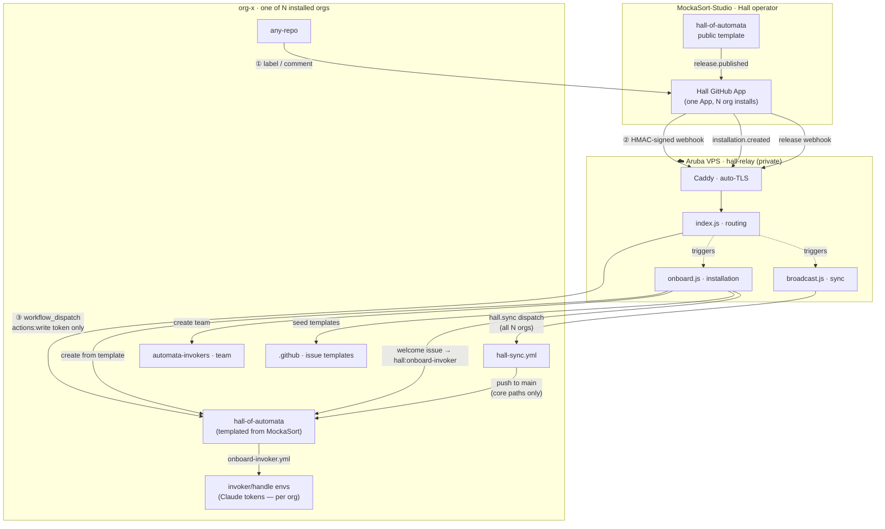

# Hall Federation & Relay Migration Plan

> **Status:** Implementation in progress.
> Last updated: 2026-03-25

---

## Goals

1. Make Hall installable to any GitHub org as a first-class product (not just a blueprint).
2. Each org gets its own isolated Hall instance — own secrets, own agents, own invoker pool.
3. A single shared relay (operated by MockaSort) routes org webhooks to the correct instance.
4. Core orchestration logic stays in GitHub Actions. No new backend beyond the relay.
5. Relay tradecraft is protected in a private repo, separate from the public template.

---

## Final Architecture



### Security boundaries

| Secret | Lives in | Visible to |
|---|---|---|
| `APP_PRIVATE_KEY` | Relay Docker env + MockaSort repo secrets | Hall operator only |
| `WEBHOOK_SECRET` | Relay Docker env | Hall operator only |
| `CLAUDE_CODE_OAUTH_TOKEN` | Each org's `invoker/<handle>` GitHub Environment | That org's admins only |
| Org installation list | GitHub App API (`GET /app/installations`) | Hall operator via API — not in any file |

Org repos use `GITHUB_TOKEN` exclusively. The App private key never lands in any org repo.

---

## Phase 1 — Aruba VPS Provisioning

*Infra only — no code changes. Produces the server the relay runs on.*

1. Write `terraform/main.tf` in `hall-relay` private repo using the `arubacloud/arubacloud` provider
2. Provision VPS (Ubuntu 24.04 LTS) + DNS A record for relay domain via `terraform apply`
   - DNS is included in Aruba Cloud — one provider, one apply, no external DNS needed
3. Attach `cloud-init.yml` at VPS creation — bootstraps on first boot:
   - Install Docker + Docker Compose plugin
   - Configure `ufw`: allow 22, 80, 443 — deny all else
   - Add weekly cron to refresh GitHub webhook IP CIDR ranges in `ufw`
   - Create unprivileged `deploy` user with Docker access

**Output:** VPS live, DNS resolving, Docker ready, firewall locked.

---

## Phase 2 — `hall-relay` Private Repo Setup

*Creates the private repo that will hold all relay tradecraft.*

1. Create `MockaSort-Studio/hall-relay` as a **private** repo
2. Move `deploy/relay/` contents from `hall-of-automata` into it — new structure:
   ```
   hall-relay/
   ├── src/
   │   ├── index.js          — webhook routing
   │   ├── onboard.js        — installation handler  (new — Phase 4)
   │   └── broadcast.js      — sync broadcaster      (new — Phase 5)
   ├── Dockerfile
   ├── docker-compose.yml
   ├── Caddyfile
   ├── terraform/
   │   ├── main.tf
   │   ├── variables.tf
   │   └── outputs.tf
   ├── cloud-init.yml
   └── .github/workflows/
       └── deploy.yml        — SSH deploy on push to main
   ```
3. Write `deploy.yml` CD pipeline: on push to `main` → SSH into VPS → `docker compose pull && up -d`
4. Store secrets in `hall-relay` repo: `ARUBA_SSH_KEY`, `APP_ID`, `APP_PRIVATE_KEY`, `WEBHOOK_SECRET`

**Output:** Private repo established, CD pipeline wired.

---

## Phase 3 — Relay Refactor (multi-org federation)

*Rewrites `src/index.js` for convention-based multi-org routing.*

1. Remove hardcoded `HALL_OWNER` / `HALL_REPO` / `HALL_REF` env vars
2. **Dynamic installation registry** — on startup and every 5 min, cache `GET /app/installations`; reject events whose `installation.id` is not in the list
3. **Per-installation token cache** — keyed by `installation.id`, not global
4. **Cross-verify** — before dispatch, confirm `GET /app/installations/{id}` → `account.login` matches `payload.repository.owner.login`
5. **Minimal token scope** — mint tokens with `{ permissions: { actions: "write" } }` only
6. **Convention routing** — dispatch to `{payload.repository.owner.login}/hall-of-automata`
7. **Per-org rate limiting** — throttle dispatch per `installation.id`
8. **Audit log** — structured stdout per dispatch: timestamp, org, repo, event type, agent, HTTP status. Never log payload content
9. **`GET /health`** — returns `200 OK`, used by Caddy and external monitoring
10. **`installation.created` handler** — calls `onboard.js` (implemented in Phase 5)
11. **`release.published` handler** — calls `broadcast.js` (Phase 6), only acts on `MockaSort-Studio/hall-of-automata`
12. **`repository.created` handler** — when a new repo is created in a Hall-installed org, seed Hall labels into it automatically via the installation token

**Output:** Relay routes any org's events to their own `hall-of-automata` instance. Hall labels are kept current in every repo across the org.

---

## Phase 4 — Deploy Relay to Aruba, Cut Over from Fly.io

*Deploys the refactored relay to Aruba. Retires Fly.io.*

1. Write `docker-compose.yml` — services: `relay` + `caddy`
2. Write `Caddyfile` — `reverse_proxy relay:3000`, auto-TLS via Let's Encrypt
3. Push to `main` → CD pipeline deploys to VPS
4. Verify `GET https://{domain}/health` → `200 OK`
5. Update Hall GitHub App webhook URL → Aruba domain
6. Confirm with GitHub App ping event delivery log
7. Run end-to-end test: apply `hall:` label on a non-hall repo → verify dispatch fires
8. Decommission Fly.io app (`fly apps destroy hall-relay`)
9. Archive `fly.toml.bak` in `hall-relay` repo for reference

**Output:** Relay live on Aruba. Fly.io retired. Existing MockaSort dispatch unaffected.

---

## Phase 5 — Installation Automation (`onboard.js`)

*Runs once per new org installation. Fully automated.*

On `installation.created`, using the new org's installation-scoped token:

1. `POST /repos/MockaSort-Studio/hall-of-automata/generate` — create `{org}/hall-of-automata` from template
2. `POST /orgs/{org}/teams` — create `automata-invokers` team; add `hall-of-automata` with `maintain` role
3. `GET /repos/{org}/.github` — check if org-level `.github` repo exists
4. If absent: `POST /orgs/{org}/repos { name: ".github" }` — create it
5. Fetch issue templates live from MockaSort: `GET /repos/MockaSort-Studio/hall-of-automata/contents/.github/ISSUE_TEMPLATE/`
6. Commit templates into `{org}/.github/ISSUE_TEMPLATE/` via contents API (always latest at install time)
7. **Seed Hall labels** into `{org}/hall-of-automata` and all existing org repos via `POST /repos/{org}/{repo}/labels` for each:

   | Label | Color | Purpose |
   |---|---|---|
   | `hall:onboard-invoker` | `#7057ff` | Trigger invoker registration |
   | `hall:onboard-automaton` | `#7057ff` | Trigger automaton provisioning |
   | `hall:active-invoker` | `#0e8a16` | Marks confirmed invoker |
   | `hall:awaiting-input` | `#e4e669` | Hall waiting on human reply |
   | `hall:queued` | `#d93f0b` | Request queued — cap reached |
   | `hall:invoker-queued` | `#d93f0b` | No invoker available |
   | `hall:dispatch-automaton` | `#5319e7` | Routes to old-major for triage |
   | Per-agent labels (from `agents.yml`) | `#0075ca` | e.g. `hall:old-major`, `hall:mergio` |

   New repos created after install are handled by the `repository.created` handler in the relay (Phase 3, step 12).

8. `POST /repos/{org}/hall-of-automata/issues` — open welcome issue with `hall:onboard-invoker` pre-applied; body includes:
   - Link to `codex/generate-token.md` (OS-specific Claude token instructions — Phase 7)
   - Steps to add first invoker
   - Link to provision Old Major

The welcome issue triggers `onboard-invoker.yml` (already in the template) — no new onboarding logic needed.

**Output:** New org is fully wired on one-click App install. Hall labels present org-wide. Zero manual setup beyond adding Claude tokens.

---

## Phase 6 — Sync Mechanism (`broadcast.js` + `hall-sync.yml`)

*Two-part: relay broadcasts on release; each org instance receives and applies the update directly to main.*

### `broadcast.js` (relay server)

Triggered by `release.published` from `MockaSort-Studio/hall-of-automata`:

1. `GET /app/installations` — enumerate all installed orgs
2. For each org: `POST /repos/{org}/hall-of-automata/dispatches` with `{ event_type: "hall.sync", client_payload: { version: "v1.2.3" } }`

### `hall-sync.yml` (lives in template — every org instance has it)

```
Triggers:
  - repository_dispatch type: hall.sync   ← broadcast push
  - schedule: cron 0 0 * * 1             ← Monday fallback
```

On trigger:
1. Fetch MockaSort's release tag
2. Apply changes to **core paths only**: `.github/workflows/`, `actions/`, `scripts/`, `agents/automaton_base.md`
3. **Skip org-customized paths**: `agents.yml`, `roster/`, `routing.yml`
4. Push directly to `main` — `"chore(sync): Hall v1.2.3"` — no PR, operator updates are trusted

**Output:** Hall updates propagate to all installed orgs on every release. Org customizations are never overwritten.

---

## Phase 7 — Template Repo Preparation

*One-time changes to `MockaSort-Studio/hall-of-automata`.*

1. Remove `deploy/relay/` — relay code now lives in the private `hall-relay` repo
2. Add `hall-sync.yml` (from Phase 6) to `.github/workflows/`
3. Verify `.github/ISSUE_TEMPLATE/` has both `new-invoker.yml` and `new-automaton.yml` (these are what `onboard.js` seeds into new orgs)
4. Review `agents.yml` and `roster/` — confirm base defaults are appropriate for a fresh install
5. Create `codex/generate-token.md` — OS-specific guide for generating a Claude OAuth token:
   - **All platforms:** Install Claude Code CLI (`npm install -g @anthropic-ai/claude-code`), run `claude`, complete the browser OAuth flow
   - **macOS / Linux:** token stored at `~/.claude/.credentials.json` → copy the `oauthToken` value
   - **Windows:** token stored at `%APPDATA%\Claude\.credentials.json` → open in any text editor, copy the `oauthToken` value
   - Remind invokers: treat this token as a password — it grants full Claude Pro/Max usage on their behalf
6. Enable **Template repository** in repo settings

**Output:** Template is clean, correct, and ready for `generate` calls from `onboard.js`. Invokers on any OS have a clear token guide.

---

## Phase 8 — GitHub App Permission Updates

*Changes to the Hall GitHub App. Do this last — triggers re-authorization for existing installs.*

Add webhook events:
- `Installation`
- `Release`
- `Repository` — for `repository.created` label seeding

Add permissions:
- `Members: write` — team creation during onboarding
- `Administration: write` (repository) — repo creation from template, environment variable management

Existing permissions unchanged: Actions, Contents, Issues, Metadata, Pull requests, Checks, Members read.

**Note:** Adding permissions surfaces a re-authorization prompt to all existing org admins. Coordinate timing — do this after Phases 1–7 are fully deployed and tested.

**Output:** App authorized for full onboarding flow.

---

## Org Secrets — `APP_ID` + `APP_PRIVATE_KEY`

Every workflow in the templated `hall-of-automata` uses `actions/create-github-app-token@v1` with `secrets.APP_ID` and `secrets.APP_PRIVATE_KEY`. These are seeded automatically by the relay during `installation.created`.

**Implementation (complete):** `onboardOrg()` step 6:
1. `GET /orgs/{org}/actions/secrets/public-key` — fetch org-level encryption key
2. Sealed-box encrypt `APP_ID` and `APP_PRIVATE_KEY` via `libsodium-wrappers`
3. `PUT /orgs/{org}/actions/secrets/APP_ID` — visibility: selected, repos: [hall-of-automata]
4. `PUT /orgs/{org}/actions/secrets/APP_PRIVATE_KEY` — same

**Why org-level (not repo-level):** Org secrets can only be managed by org admins. Repo secrets can be deleted by any repo admin, breaking all Hall workflows. Selected-repository visibility ensures no other repo in the org can read them.

**Security note:** The App private key is replicated into each org's encrypted secrets. Acceptable trade-off: secrets are encrypted at rest (GitHub's sealed box), never readable via API, and only accessible to workflow runners. Org admins are informed via the welcome issue not to modify these secrets.

**MockaSort-Studio:** Migrated from repo secrets to org secrets via `gh secret set --org`. Old repo-level secrets deleted.

Requires: `organization_secrets: write` App permission (Phase 8).

---

## Implementation Sequence

```
Phase 1   Aruba VPS provisioning        ✓ VPS live, Docker ready, firewall locked
                                          ✓ DNS: hall.relay.mockasort-studio.eu → VPS IP
Phase 2   hall-relay private repo        ○ deferred — working in-repo until stable
Phase 3   Relay refactor                 ✓ index.js rewritten (multi-org, audit log, dedup)
                                          ✓ labels.js (shared label definitions)
                                          ✓ onboard.js (installation automation)
                                          ✓ broadcast.js (sync broadcaster)
                                          ✓ docker-compose.yml + Caddyfile
                                          ✓ deploy.sh (Aruba/SSH, replaces Fly.io)
                                          ✓ old-major: pure orchestrator, self-routing removed
                                          ✓ hall:old-major blocked in relay SYSTEM_LABELS
                                          ✓ audit log: all org/repo identifiers masked
Phase 4   Deploy to Aruba, cut over      ✓ relay live on Aruba, end-to-end verified
                                          ✓ Fly.io decommissioned
Phase 5   onboard.js                     ✓ complete; issue template path fixed (.github/ISSUE_TEMPLATE/)
Phase 6   broadcast.js + hall-sync.yml   ✓ broadcast.js: operator org skipped in sync loop
                                          ✓ hall-sync.yml: direct push to main (no PR)
                                          ✓ App webhook: Releases event must be enabled
Phase 7   Template prep                  ✓ codex/generate-token.md written; nav entry added
                                          ✓ welcome issue points to codex docs page
                                          → deploy/relay/ still in public template (Phase 2 deferred)
                                          → Enable Template repository flag (manual — GitHub repo settings)
Phase 8   GitHub App permissions         ○ organization_secrets:write (org secret seeding)
                                          ○ Members:write (team creation)
                                          ○ Administration:write (repo creation)
                                          ○ Release webhook event (broadcast trigger)
                                          ○ Repository webhook event (label seeding on new repos)
                                          ○ Installation webhook event (onboard trigger)
```

### Next steps (in order)

1. **GitHub App permissions** — organization_secrets:write, Members:write, Administration:write; Release + Repository + Installation webhook events (Phase 8)
2. **Enable Template repository** flag on `MockaSort-Studio/hall-of-automata` (manual — repo settings)
3. **Test sync** — create a release tag; verify test org receives `hall.sync` and pushes to main
4. **Phase 2** — move `deploy/relay/` to private `hall-relay` repo when ready

---

## Fly.io Decommission

> **Prerequisite:** Aruba relay confirmed live and stable. GitHub App webhook URL already pointing to Aruba.

### Steps

1. **Verify no traffic on Fly.io**
   ```bash
   fly logs --app hall-relay
   ```
   Confirm no webhook deliveries arriving (all should be going to Aruba).

2. **Destroy the Fly.io app**
   ```bash
   fly apps destroy hall-relay
   ```
   Type the app name to confirm. This is irreversible.

3. **Remove Fly.io secrets** (already gone with the app, but verify)
   ```bash
   fly secrets list --app hall-relay   # should error — app no longer exists
   ```

4. **Remove Fly.io config from repo**
   - Delete `deploy/relay/fly.toml` (or `fly.toml.bak`) if present
   - Remove any `fly` references from CI workflows

5. **Revoke Fly.io API token** (if one was created for CI)
   - Go to fly.io dashboard → Account → Access Tokens → delete the Hall relay token

6. **Cancel Fly.io plan** (if on a paid tier)
   - fly.io dashboard → Billing — confirm no active apps incurring charges
