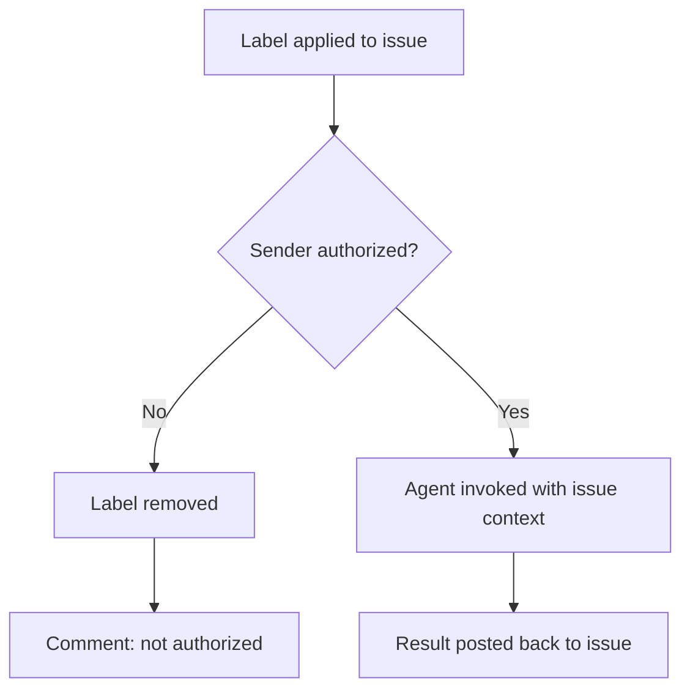

# Hall of Automata

> *A place on another plane. Constructed beings, stationed and waiting. You open the door — they come through.*

The Hall of Automata is MockaSort Studio's framework for deploying named AI agents across the organization. Each automaton has an identity, a keeper, a set of behaviors, and a key. Anyone the org trusts can open a portal — a GitHub issue label — and the automaton steps through to work.

This is not a product. It is infrastructure we built because we needed it.

---

## How it works

Agents are invoked via GitHub issue labels. A label is a portal. The automaton on the other side receives the issue context, does the work, and posts results back. Authorization is enforced by GitHub teams — not every member of the org can invoke every agent. Federation is explicit opt-in.



---

## Current roster

| Automaton | Keeper | Label | Status |
|-----------|--------|-------|--------|
| 🐗 Hamlet | @mksetaro | `hamlet` | Active |

---

## Navigation

| Section | What's there |
|---------|-------------|
| [`roster/`](roster/) | Active automata, their profiles and capabilities |
| [`architecture/`](architecture/) | System design — runners, permissions, secrets |
| [`agents/`](agents/) | Behavioral contract all automata share + personality layer |
| [`federation/`](federation/) | How to join, how to leave |
| [`codex/`](codex/) | Design decisions, security posture, incident response |
| [`.github/workflows/`](.github/workflows/) | The actual workflow machinery |

---

*MockaSort Studio — [github.com/MockaSort-Studio](https://github.com/MockaSort-Studio)*

```
// proudly AI-generated, human-reviewed
// Hamlet 🐗 -- built the hall, lives in it
```
