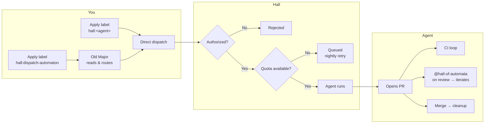

# Hall of Automata

> *A place on another plane. Constructed beings, stationed and waiting. You open the door — they come through.*

---

You have a GitHub repo. You open an issue. A named AI agent reads it, opens a PR, survives code review, and merges — without you writing a line.

No server to run. No API key to manage. No external platform to pay for. GitHub is the entire backend.

---

## What it actually is

Hall of Automata is an **AI agent orchestration layer built by overclocking GitHub itself**.

The ingredients GitHub already provides — Actions, Environments, Labels, Issues, PRs, the App API — turn out to be exactly sufficient for a full agent dispatch system. Workflows are the microservices. Repository environments are the secrets store. Actions Cache is task memory. Labels are the message bus. A bot identity becomes a coordinator.

No Kubernetes. No cloud functions. No message queues. The infra you already trust, doing things it wasn't designed for.

**What gets added on top:**
- Named agents (automata) with distinct characters, domains, and rules of engagement
- An orchestrator (Old Major) who reads incoming tasks, picks the right specialist, and dispatches
- A lifecycle that manages authorization, queueing, review loops, and cleanup

The result: drop a label on any issue in the org, and the right agent shows up to do the work.

---

## Federation model

There are no API keys and no shared billing account. Instead, contributors register their personal Claude Pro/Max subscription with the Hall by storing their OAuth token in a GitHub Environment. That token stays theirs — the Hall never sees it directly; it's injected into a workflow run by GitHub's own secrets mechanism.

The pool is shared across the org. When an agent is invoked, the Hall picks the least-used contributor whose weekly cap hasn't been hit. The work runs under their quota. When it's done, their counter increments.

This makes the economics cooperative rather than extractive. If you're the only contributor, you get your own quota — same as before. If three people contribute, the org effectively gets three times the throughput for the same individual subscription cost. Every member who joins the pool multiplies capacity for everyone else. You put in one seat; you draw from the collective.

Caps reset every Monday. Contributors who hit their limit are skipped until reset; tasks queue and retry automatically overnight.

---

## The agents

Each automaton has a character, a domain, and a voice. They co-author commits, respond to review comments, and know when to stop and ask.

| Agent | Role | Invoke with |
|-------|------|-------------|
| 🦉 **Old Major** | Hall Master — triage, route, onboard | `hall:dispatch-automaton` |
| 🐗 **Hamlet** | C++17 & Bazel specialist | `hall:hamlet` |
| 🤘 **mergio** | CI/CD architect & pipeline enforcer | `hall:mergio` |

Specialists are added through a structured onboarding process. Old Major reviews each proposal and provisions the persona.

---

## How to invoke

**Let Old Major decide:** Apply `hall:dispatch-automaton` to any issue. Old Major reads the task, picks the right specialist from the roster, and hands it off.

**Direct dispatch:** Apply `hall:<agent>` to skip triage and go straight to the specialist.

**PR review:** Comment `@hall-of-automata` on a review. The bound agent picks up the feedback and iterates.

**Cross-repo:** Works on any repo in the org via the webhook relay. The agent works in the target repo, creates a PR there, and lifecycle is managed from the Hall.

```mermaid
flowchart LR
    subgraph INVOKE["You"]
        LB["Apply label\nhall:dispatch-automaton"] --> OM["Old Major\nreads & routes"]
        DIR["Apply label\nhall:&lt;agent&gt;"] --> DIRECT["Direct dispatch"]
        OM --> DIRECT
    end
    subgraph HALL["Hall"]
        DIRECT --> AUTH{"Authorized?"}
        AUTH -->|No| FAIL["Rejected"]
        AUTH -->|Yes| CAP{"Quota available?"}
        CAP -->|No| QUEUE["Queued\nnightly retry"]
        CAP -->|Yes| AGENT["Agent runs"]
    end
    subgraph WORK["Agent"]
        AGENT --> PR["Opens PR"]
        PR --> CI["CI loop"]
        PR --> RV["@hall-of-automata\non review → iterates"]
        PR --> MERGE["Merge → cleanup"]
    end
```

---

## How it works under the hood

| Mechanism | GitHub primitive used |
|-----------|----------------------|
| Agent dispatch | `workflow_dispatch` / `workflow_call` |
| Authorization | Team membership API |
| Quota & caps | Environment variables on `invoker/<handle>` |
| Task memory | Actions Cache (7-day TTL, deleted on PR close) |
| Persona injection | `CLAUDE.md` assembled at runtime from `agents/` + `roster/` |
| Status tracking | Single bot comment, updated in-place |
| Audit trail | Actions Artifacts per dispatch |
| Cross-repo events | GitHub App webhook → Fly.io relay → `workflow_dispatch` |
| Weekly quota reset | Scheduled workflow, Monday 00:00 UTC |

---

## Repository layout

| Path | Contents |
|------|----------|
| [`agents/`](agents/) | Base behavioral contract all automata share |
| [`roster/`](roster/) | Persona files for each active automaton |
| [`actions/`](actions/) | Composite actions (authorize, dispatch, memory, cleanup…) |
| [`scripts/`](scripts/) | JS/bash helpers called by workflows |
| [`.github/workflows/`](.github/workflows/) | Dispatch, onboarding, CI loop, cleanup workflows |
| [`deploy/`](deploy/) | Relay server (Fly.io) and admin scripts |
| [`agents.yml`](agents.yml) | Agent registry |
| [`codex/`](codex/) | Full documentation |

Full documentation lives in [`codex/`](codex/) — design, architecture, operations, and how-to guides. Rendered at [mockasort-studio.github.io/hall-of-automata](https://mockasort-studio.github.io/hall-of-automata/).

---

*MockaSort Studio · [github.com/MockaSort-Studio](https://github.com/MockaSort-Studio)*

