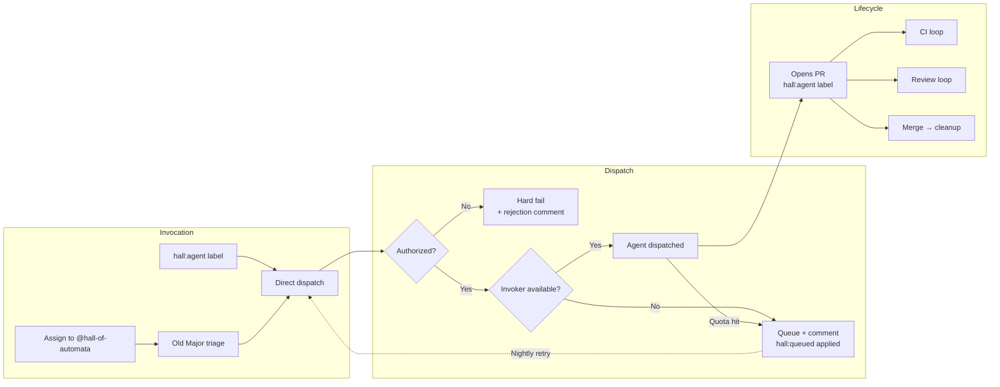

# Hall of Automata

> *A place on another plane. Constructed beings, stationed and waiting. You open the door — they come through.*

Hall of Automata is MockaSort Studio's federated AI agent orchestration layer, built on GitHub Actions. Contributors donate their Claude Pro/Max subscription quota to a shared pool. The Hall dispatches named agents on demand, tracks keeper usage, enforces caps, and provides a unified bot identity across the org — no API keys, no shared billing accounts.

---

## How invocation works

**Directed:** Apply a `hall:<agent>` label to any issue or PR. The named agent is dispatched directly.

**Unlabeled:** Assign the issue or PR to `@hall-of-automata`. Old Major (the Hall Master) analyzes the task, selects the right specialist from the roster, synthesizes context, and dispatches.

In both cases: authorization is checked first. Non-members of `automata-invokers` are hard-rejected. The agent works, opens a PR, and the Hall manages the lifecycle through CI, review, and merge.

```mermaid
flowchart LR
    subgraph INVOKE["Invocation"]
        LB["hall:agent label"] --> DIRECT["Direct dispatch"]
        AS["Assign to @hall-of-automata"] --> OM["Old Major triage"]
        OM --> DIRECT
    end
    subgraph DISPATCH["Dispatch"]
        DIRECT --> AUTH{"Authorized?"}
        AUTH -->|No| FAIL["Hard fail\n+ rejection comment"]
        AUTH -->|Yes| CAP{"Invoker available?"}
        CAP -->|No| QUEUE["Queue + comment\nhall:queued applied"]
        QUEUE -.->|"Nightly retry"| DIRECT
        CAP -->|Yes| AGENT["Agent dispatched"]
        AGENT -->|"Quota hit"| QUEUE
    end
    subgraph LIFECYCLE["Lifecycle"]
        AGENT --> PR["Opens PR\nhall:agent label"]
        PR --> CI["CI loop"]
        PR --> RV["Review loop"]
        PR --> MERGE["Merge → cleanup"]
    end
```

---

## Repository layout

| Path | What's there |
|------|-------------|
| [`agents/`](agents/) | Base behavioral contract all automata share; persona format template |
| [`roster/`](roster/) | Old Major's persona (Hall infrastructure — lives in repo). Specialist personas live in Gists. |
| [`actions/`](actions/) | Reusable GitHub composite actions (authorize, dispatch, memory, cleanup…) |
| [`scripts/`](scripts/) | JS/bash helpers called by workflows |
| [`.github/workflows/`](.github/workflows/) | Dispatch, CI loop, cleanup workflows |
| [`agents.yml`](agents.yml) | Agent registration record and routing defaults |
| [`routing.yml`](routing.yml) | Routing strategy and cap overrides |
| [`codex/`](codex/) | Full documentation — design, architecture, operations, federation |

## Documentation

The [`codex/`](codex/) folder is the single source of truth for design decisions, architecture, and operations. Start at [`codex/index.md`](codex/index.md).

---

*MockaSort Studio · [github.com/MockaSort-Studio](https://github.com/MockaSort-Studio)*

