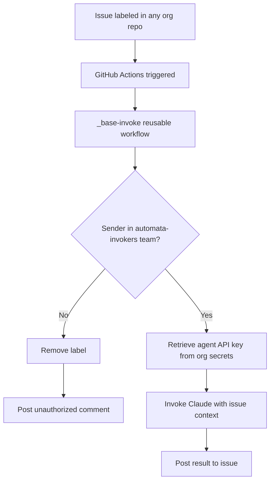

# Architecture

The Hall of Automata runs on GitHub Actions. No external infrastructure. No self-hosted runners. The machinery lives in the repo — readable, auditable, changeable.

---

## Overview

---

## Sections

| Document | What it covers |
|----------|---------------|
| [`runner-model.md`](runner-model.md) | GitHub-hosted runners — why, what they are, what they can't do |
| [`permissions-model.md`](permissions-model.md) | GitHub teams as the authorization layer |
| [`secrets-model.md`](secrets-model.md) | What lives in org secrets, what doesn't, and why |

---

## Design rationale

The full record of options considered and why this architecture was chosen is in [`codex/design-options.md`](../codex/design-options.md).
