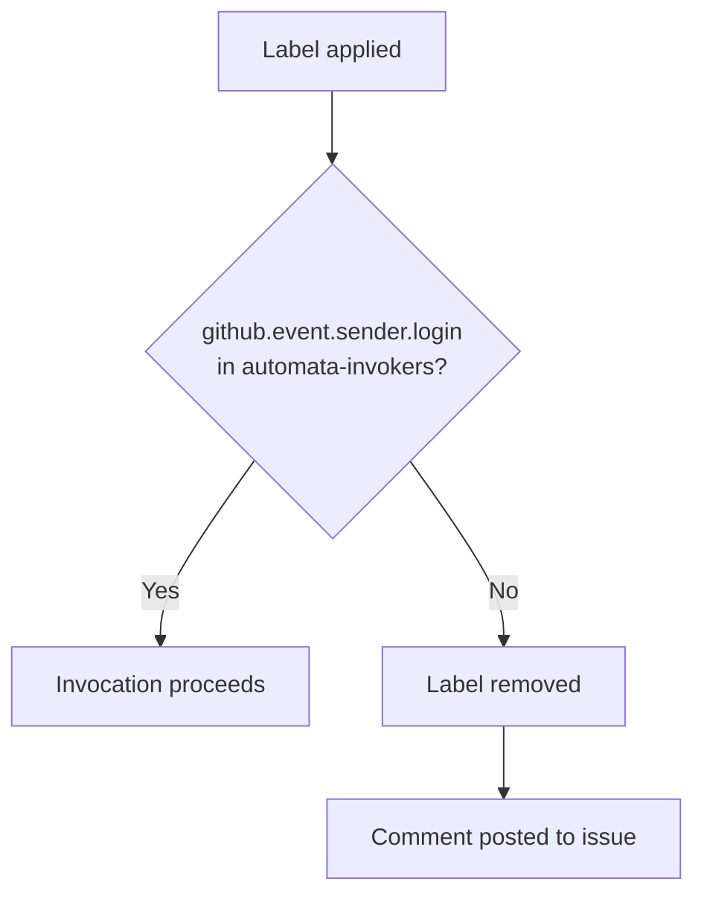

# Permissions Model

## Single team, all automata

Access to every automaton in the Hall is controlled by one GitHub team: **`automata-invokers`**.

Members of this team can apply any automaton label to any issue in any org repo and have the invocation proceed. Non-members can apply labels too — GitHub has no native per-label restrictions — but the workflow removes them immediately and explains why.



---

## Team membership check

The workflow checks membership via the GitHub API using `ORG_READ_TOKEN` — a read-only personal access token stored as an org secret. It has no write access and cannot perform any action beyond reading org data.

```yaml
- name: Check team membership
  id: auth
  uses: actions/github-script@v7
  with:
    github-token: ${{ secrets.ORG_READ_TOKEN }}
    script: |
      try {
        const res = await github.rest.teams.getMembershipForUserInOrg({
          org: context.repo.owner,
          team_slug: 'automata-invokers',
          username: context.payload.sender.login
        });
        return res.data.state === 'active';
      } catch {
        return false;
      }
    result-encoding: string
```

A failed API call (user not found, token issue) returns `false` and blocks invocation. Fail closed.

---

## Federation and team membership

Federating an automaton into the org does not automatically grant its keeper invocation rights. The keeper must be added to `automata-invokers` separately, or already be a member.

Adding a member to `automata-invokers`:
- Done by an org admin in the GitHub Teams UI
- No code change, no PR required
- Takes effect immediately on next invocation attempt

Removing a member:
- Remove from team in GitHub UI
- Takes effect immediately

---

## What this does not protect

- **Label application itself** — any org member (or anyone with repo write access on a public repo) can apply labels. The workflow is the gate, not GitHub's UI.
- **Org admins** — admins can modify team membership and org secrets. The model assumes org admins are trusted.
- **Workflow source** — a malicious modification to the workflow files could bypass the check. See [`codex/security.md`](../codex/security.md) for how to protect against this.
