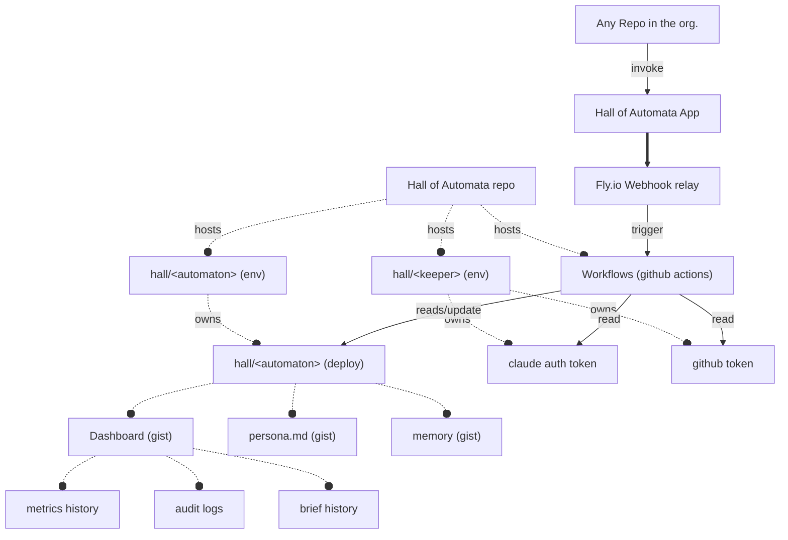

# Lore Keeper requested revision

This file contains revisions and remarks made by lore keeper after review.

## Design Document Review comments:

Reference [design document](./design_document.md)

### USE CASES Review

#### UC-1
**Review comment:** invokation happens in two ways: setting the label corresponding to an automaton, assigning issue/pr to @hall-of-automata which will go through the issue and dispatch the right agent. Invokation without label could trigger a super agent (hall master) specialized in issue filtering and dispatching by having access to roster and issue it outputs the right agent to be dispatched. 

#### UC-4:

**Review comment:** move from agent weekly cap to keeper weekly cap, automata are a predefined personas not the claude account.

#### UC-5

**Review comment:**: summary  comment has to be mandatory

#### UC-6

**Review comment:**: change accordingly to requested changes on UC-1

### Requirements Review

#### Functional Requirements

**Review comment:**
- FR-1 needs to be revisited according to comment in UC-1
- FR-2 keeper auth must happen as first step in the flow
- NEW FR: target Repo CLAUDE.md is immutable, should only be used to extract specific constraints  to be added on top of persona+task context
- NEW FR: no injection of permanent content in repo, hall's memory and persona should be tmp files restored from the cache, to be added only when calling claude action.
- NEW FR: persona definition should have clear guidelines and requirements, this enable specialization of automaton and it should be analytic, clear and concise. Rationale: agent works better when in it's fed a specialized, concise context (e.g. cpp specialized agents will naturally focus on those details)
- NEW FR: persona creation happens through specialized issue template, issue opening triggers the hall master (specialized agent in hall chores) that will run verifications and push new automaton to roster (only accepted by automata-invokers)
- NEW FR: all commits made by automata are co-authored with automata name (could be useful for future reference and auditing)
- NEW FR: unauthorized invocation must result in hard failure of workflow and a verbose failure comment by also tagging automata-invokers team
- Organization automata definition should be placed in a different repo, roster repo and hall repo should share the same structure, wtr to automata definition, and at runtime when if the repo does not exists fallback to hall roster. maybe the roster repo could be set as a repo variable

## Refactoring

### Hall of Automata infra

Exploit deployments for automata lifecycle. Each automaton is a deployment that hosts (through GIST) everything regarding its lifecycle:
persona, memory of current task, audit logs, some stats/kpi. 1 deploy per env which is created at automaton creation and updated during usage.
no deploy per usage. Which makes necessary to rethink envs (keeper env as separated deploy or just behind the curtain and env per agent)

Easily accessible by actions, fully using github

leverage on deploy as lifecycle for existing automaton and keeper secrets.

in particular: when creating new automata, through issue form that defines persona. New env e new deploy gets dispatched, which in it's payload contains the information mapping of the resources it contains: 
- Gist with persona definition
- Gist with memory of currently working task (otherwise empty)
- Gist with dashboard conaining metric, history, audit log

Keeper env instead features:
- Secrets (github and claude token)
- Weekly Cap counter

Deploy get's updated through github deployment api by hall of automata at each invocation

### Escation edit
When max retries have been attempted escalate to issue creator

### Onboarding process
discussion of UX for onboarding, check review comments in design document.
Proposed approach: issue template for new automaton, hall master reviews automata definition (review comments should go in ) if it's good add to roster -> instruct issue opener to add hall/<keeper> in environment -> test agent invoke using keeper env -> merge/close

onboarding workflows should be separated from general dispatching system.

### Multi-Agent work flow from triaging to issue resolution
workflows are becoming quite overwhealming to review. particularly the decisional gates. Having a hall master automaton enables to leverage on it to take over decisional gating (e.g. picking the keeper's account based on weekly cap and usage, First dispatch of agent by pre analysing request, creating a context + extraction of specific constraints from target repo CLAUDE.md ). This would enable better separation between stages (ingest -> analyse(hall-master) -> dispatch right agent), resulting in better implementation of  workflows.

Goal: optimize agent accuracy and quota usage.
Possible guardrails:
Your Analysis Agent should act as a Project Manager, not just a dispatcher. It should decompose a task if it meets any of the following "Complexity Triggers":Dependency Depth: If the change touches more than $N$ (e.g., 3) distinct Bazel packages.Logic Heterogeneity: If the task requires both a performance optimization (C++) and a structural build change (BUILD.bazel or MODULE.bazel). These are different "brain states."The "Ambiguity Check": If the Analysis Agent cannot map the issue description to a specific set of files with $>80\%$ confidence, it should stop and request more input rather than dispatching.Rule of Thumb: If the predicted diff is $>200$ lines or spans across unrelated modules, the Analysis Agent should spawn Sub-Issues. This keeps the specialized agent's context window focused and its "hallucination surface area" small.

### 🔧 Persona restructure — character sheet model

---> hosted as discussion in org discussion

Current `roster/hamlet.md` mixes personality with a tech skills list (C++, build systems). Tech skills are implicit for a senior-level agent — listing them adds noise and drifts out of sync.
Add analysis in codex for persona formatting to optimize comprehension of llm
Proposal: split the persona into three sections:
- **Character** — identity, tone, behavioral rules, signature style (the D&D sheet)
- **Domains** — named capability bundles that imply a toolset without enumerating individual tools
- **Scope** — right call for / not the right call for

`capabilities` in `agents.yml` unifies two axes that must stay in sync with the persona:
- **Roles** — functional position: `implement`, `review`, `fix`, `refactor`, `advise`, `research`. Keeper-assigned; maps to invocation modes.
- **Domains** — meaningful bundles, not tool lists. Examples: `github-admin` (GitHub API, label/PR management), `devops` (CI config, pipelines), `infra` (provisioning, cloud). The name implies the affordances — no enumeration needed.

Routing (FR-9) matches on roles first, then domains. Future agents scoped to review-only or infra-only are naturally expressible without schema changes.

---

### 🔧 FR-9: Automatic routing (cap → least-used agent)

check review comment in design document UC-1.

Currently when an agent exceeds its weekly cap the Hall posts a comment and exits. The design calls for rerouting to the least-used eligible agent with matching capabilities.

What needs to happen in `invoke.yml` dispatch job:
1. After cap check fires, query the counter cache for all agents
2. Filter by `capabilities` overlap with the requested agent (from `agents.yml`)
3. Pick the agent with the lowest count that is still under its own cap
4. Re-run auth + dispatch with the alternate agent
5. Post a comment noting the reroute (`rerouted: true` in audit log)

`routing.yml` `strategy: least_used` and `fallback: queue` are already parsed — implement the lookup and fallback to `hall:queued` label when all alternates are also capped.

### General reconciliation of documentation

Documentation is redundant and ofter outdated wtr to current design.
Diagram in general need to be easier to read.