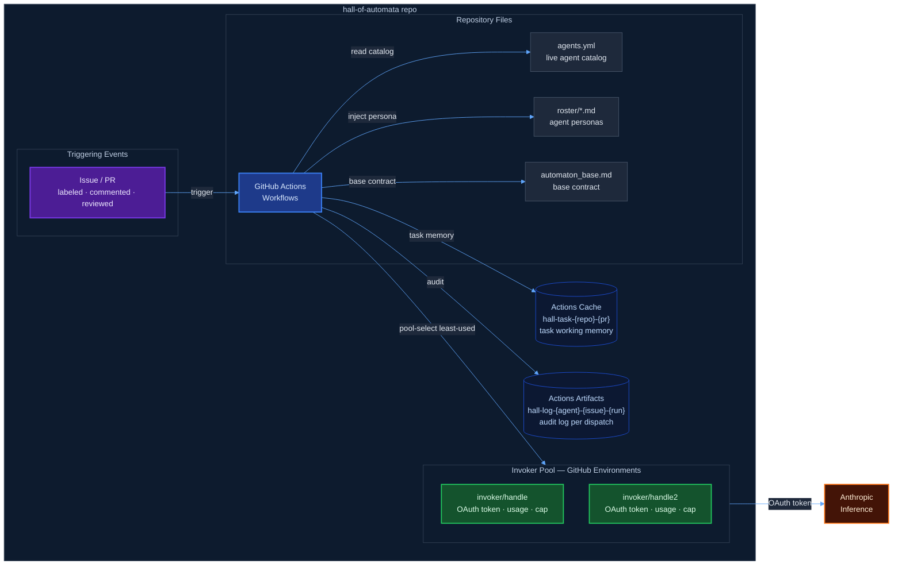
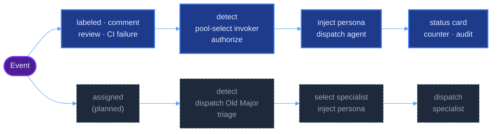

# Architecture

The Hall of Automata runs on GitHub Actions. No self-hosted runners. No external databases. All state lives in GitHub infrastructure — repository files, Environments, Actions Cache, and Artifacts.

---

## Overview

---

## Invocation paths

**Labeled path** — a `hall:<agent>` label is applied to an issue or PR. The named agent is dispatched directly.

**Comment path** — `@hall-of-automata[bot] <agent>` is posted as a comment. The named agent is dispatched directly.

**Awaiting-input path** — an issue has `hall:awaiting-input` and `hall:<agent>` labels, and a human posts a new comment. The same agent is re-dispatched with the reply as additional context.

**PR review path** — a reviewer `@mention`s the bot in a pull request review. The agent is re-dispatched with the review feedback appended to its task memory.

**CI failure path** — a failing check suite on a `hall/*` branch triggers `hall-ci-loop.yml`. The agent is re-dispatched up to `max_retries` times before invoker escalation.

**Assignment path** *(planned)* — an issue is assigned to `@hall-of-automata` without specifying an agent. Old Major runs first to triage, select the right specialist, and synthesize context.

---

## Dispatch flow

In all current paths: the workflow checks out the Hall repo, reads `roster/{agent}.md` and `agents/automaton_base.md`, assembles them into `CLAUDE.md` in the workspace, and runs the Claude Code Action in a pool-selected `invoker/<handle>` environment. The CLAUDE.md is never committed — the runner is ephemeral.

---

## Sections

| Document | What it covers |
|----------|---------------|
| [`runner-model.md`](runner-model.md) | GitHub-hosted runners, persona injection, state persistence |
| [`permissions-model.md`](permissions-model.md) | GitHub teams as the authorization layer |
| [`secrets-model.md`](secrets-model.md) | Invoker pool environments, secrets, and variables |
| [`ci-loop-and-checks.md`](ci-loop-and-checks.md) | CI re-dispatch loop, PR checks side effects, and design rationale |

---

## Design rationale

The full record of options considered and why this architecture was chosen is in [`codex/design-options.md`](../design-options.md).
