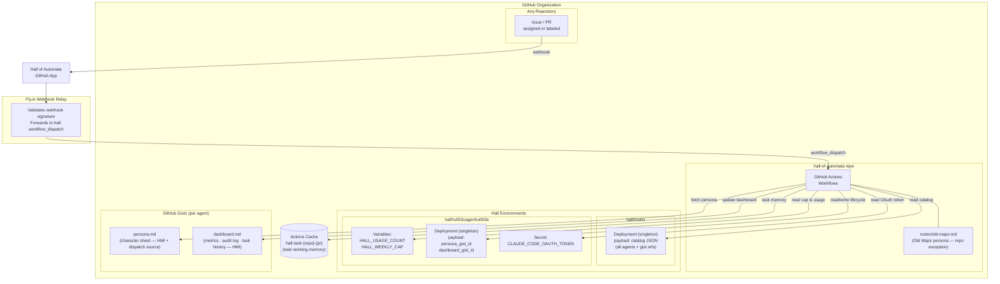

# Architecture

The Hall of Automata runs on GitHub Actions backed by GitHub Deployments and Gists. No self-hosted runners. No external databases. All state lives in GitHub infrastructure.

---

## Overview



---

## Invocation paths

**Labeled path** — a `hall:<agent>` label is applied to an issue or PR. The named agent is dispatched directly. No Old Major triage step.

**Assignment path** — a issue or PR is assigned to `@hall-of-automata` without specifying an agent. Old Major runs first: reads the roster catalog from the `hall/roster` deployment, analyzes the task, selects the most capable available agent, synthesizes the task context, and dispatches the specialist. If confidence is insufficient, Old Major posts a clarifying question and enters the awaiting-input state.

---

## Dispatch flow

```
Event
  ├─ labeled      → authorize → fetch persona (gist) → dispatch specialist
  └─ assigned     → authorize → dispatch Old Major
                                    └─ triage → synthesize context
                                         └─ fetch persona (gist) → dispatch specialist
```

In both paths: persona is fetched from the agent's gist (via the `hall/<agent>` deployment payload), assembled with the base contract into CLAUDE.md, and the target repo's own CLAUDE.md (if any) is stashed as `.hall-local.md` for the agent to read.

---

## Sections

| Document | What it covers |
|----------|---------------|
| [`runner-model.md`](runner-model.md) | GitHub-hosted runners, persona injection, state persistence |
| [`permissions-model.md`](permissions-model.md) | GitHub teams as the authorization layer |
| [`secrets-model.md`](secrets-model.md) | Keeper environments, secrets, variables, and deployment payloads |

---

## Design rationale

The full record of options considered and why this architecture was chosen is in [`codex/design-options.md`](../codex/design-options.md).
