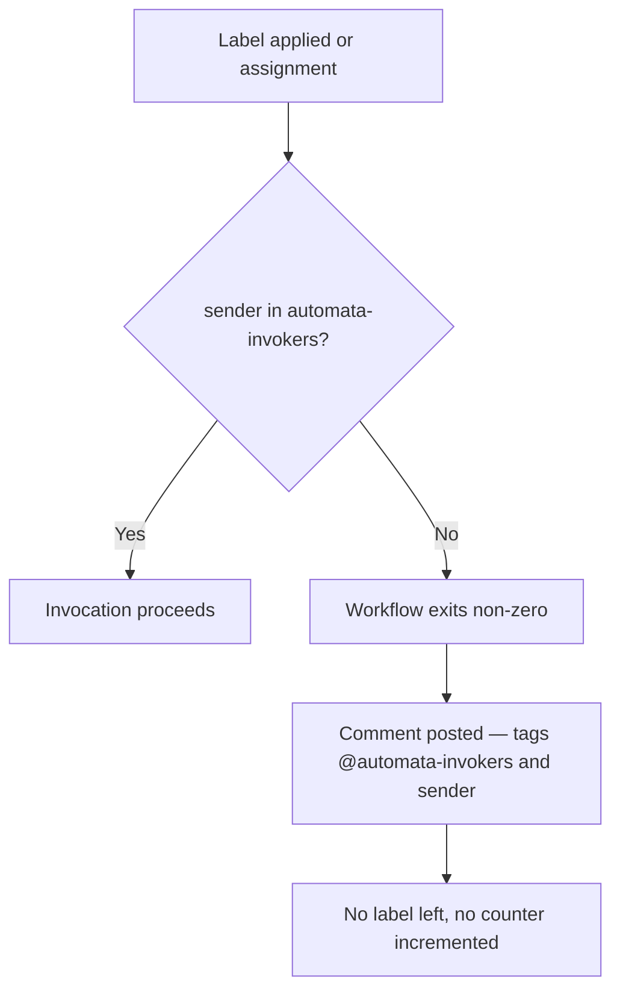

# Permissions Model

## Single team, all automata

Access to every automaton in the Hall is controlled by one GitHub team: **`automata-invokers`**.

Members of this team can invoke any automaton via label or `@hall-of-automata` assignment. Non-members trigger a hard workflow failure: the invocation is aborted, an explanatory comment is posted tagging both `@automata-invokers` and the invoker, and no usage counter is incremented.



---

## Team membership check

The Hall App is registered with **Members: read** organization permission. Authorization uses the App's installation token — no separate `ORG_READ_TOKEN` PAT is needed.

```javascript
const res = await github.rest.teams.getMembershipForUserInOrg({
  org: context.repo.owner,
  team_slug: 'automata-invokers',
  username: context.payload.sender.login
});
return res.data.state === 'active';
```

A failed API call (user not found, token issue, API error) returns `false` and triggers the hard-fail path. Fail closed — invocation never proceeds on ambiguity.

---

## Federation and team membership

Federating an automaton does not automatically grant its keeper invocation rights. The keeper must be added to `automata-invokers` separately, or already be a member.

Adding a member:
- Org → Teams → `automata-invokers` → Add member
- No code change, no PR required
- Takes effect immediately

Removing a member:
- Remove from team in GitHub UI
- Takes effect immediately

---

## What this does not protect

- **Label application itself** — any org member (or anyone with repo write access on a public repo) can apply labels. The workflow is the gate, not GitHub's label UI.
- **Org admins** — admins can modify team membership and environment secrets. The model assumes org admins are trusted.
- **Workflow source** — a malicious modification to workflow files could bypass the check. See [`../security.md`](../security.md) for branch protection controls.
