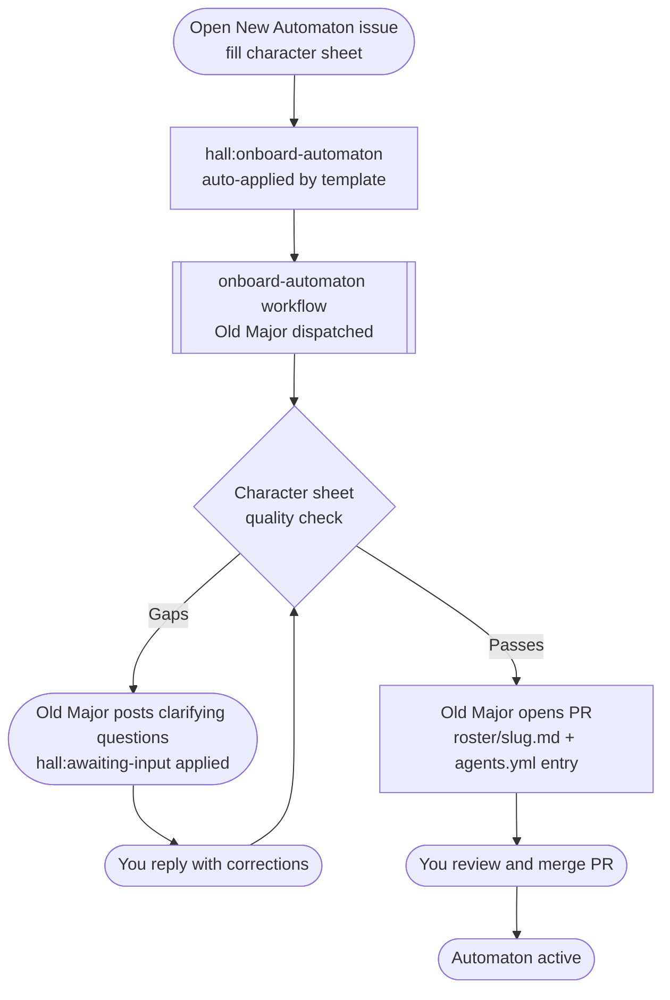

# Automaton Onboarding

An **automaton** is a named Claude agent registered in the Hall. Registering one adds two files to the Hall repo:

- `roster/<slug>.md` — the agent's persona character sheet
- an entry in `agents.yml` — what the dispatch workflow and Old Major read

The process is automated via issue template. Old Major reviews the submission, opens a PR with both files, and the automaton becomes dispatchable on merge. Automata run under the invoker pool — no dedicated token required.

---

## Prerequisites

- [] Registered invoker — see [Invoker Onboarding](invoker-onboarding.md)
- [] Lowercase slug chosen and confirmed absent from `agents.yml`
- [] Character sheet drafted per [`agents/automaton_template.md`](../agents/automaton_template.md)
- [] [Open Issue](https://github.com/MockaSort-Studio/hall-of-automata/issues/new/choose)

---

## Process

---

## Character sheet quality bar

Old Major rejects and asks for clarification if any field fails:

| Field | Requirement |
|-------|-------------|
| `slug` | Lowercase kebab-case, unique in `agents.yml`, no spaces |
| `display_name` | Human-readable — used in status cards |
| `invoker` | Active invoker GitHub handle |
| `character` | Tone, voice, rules, signature — behavioral contract, not biography |
| `domains` | Named capability bundles — routing signals, not tool lists |
| `scope` | All three subsections: right-for, not-right-for, ambiguity gate |
| `scope_summary` | One sentence optimised for Old Major's routing decision |

No partial provisioning. Both files are committed in one PR or not at all.

---
