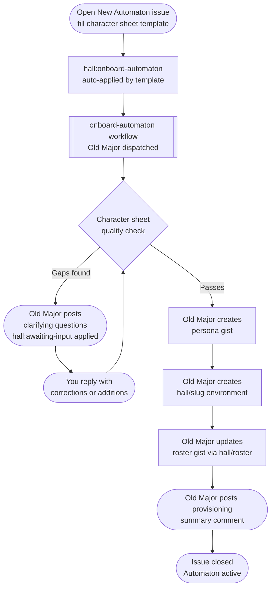

# Automaton Onboarding

An **automaton** is a named Claude agent registered in the Hall. Registering one creates three artifacts:

- a **persona gist** — the agent's behavioural contract, fetched at dispatch time
- a **`hall/<slug>` GitHub Environment** — holds the OAuth token and operational variables
- a **roster entry** — what Old Major consults when routing tasks to specialists

The full process is automated. Old Major handles provisioning; you supply the character sheet and the credential.

---

## Prerequisites

- You are a registered invoker — see [Invoker Onboarding](invoker-onboarding.md)

Automata run under your Claude OAuth token. No separate subscription or credential is required — your invoker registration is the key.

---

## Process

---

## Character sheet quality bar

Old Major will reject (and ask for clarification) if any of these are missing or unusable:

| Field | Requirement |
|-------|-------------|
| `slug` | Lowercase kebab-case, unique in roster, no spaces |
| `display_name` | Human-readable — shown in status cards and comments |
| `invoker` | Active invoker GitHub handle |
| `character` | Tone adjectives, voice notes, automaton-specific rules, signature — behavioural contract, not biography |
| `domains` | Named capability bundles — routing signals, not tool lists. The name implies affordances |
| `scope` | All three subsections present: right-for, not-right-for, ambiguity gate |
| `scope_summary` | One sentence, optimised for Old Major's routing decision at triage time |

A submission that doesn't meet the bar gets a clarifying comment, not a partial provision. No gist or environment is created until the sheet passes.

---

## After provisioning

The automaton is dispatchable immediately — it runs under the registering invoker's OAuth token, which is already in place. Old Major posts a provisioning summary on the issue before closing it.
