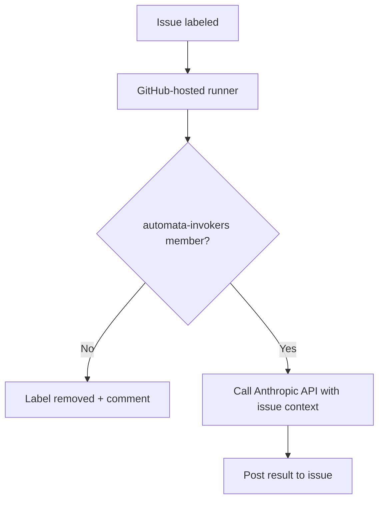
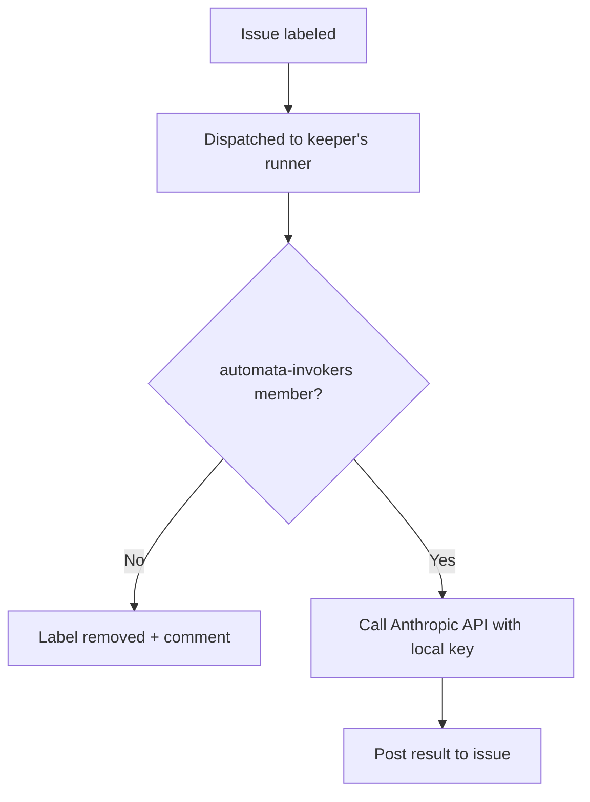

# Design Options

The full record of architectural options evaluated for the Hall of Automata invocation system, and the reasoning behind the final choice.

---

## The problem

MockaSort Studio needed a way for org members to invoke named AI agents (automata) on GitHub issues, with:

- Per-member API keys and billing (each automaton's cost is traceable to a keeper)
- Authorization controls (not every org member can invoke every automaton)
- Consistent behavior across all automata
- Minimal infrastructure overhead
- Auditable invocation history

---

## Options evaluated

### Option A — GitHub Actions + org secrets (chosen)

**Architecture:** GitHub-hosted runners handle orchestration. Per-automaton API keys stored as org secrets. A single `ORG_READ_TOKEN` (read-only) checks team membership. Invocation is triggered by issue labels.

**Authorization:** One GitHub team (`automata-invokers`) gates all automata. Membership check runs in the workflow via GitHub API.

**Pros:**
- Zero member infrastructure — no machine needs to be online
- Available 24/7, GitHub manages the compute
- Full audit trail in Actions logs and issue comments
- Simple to onboard new automata — add secret, add workflow, add roster entry
- Per-automaton billing via separate keys

**Cons:**
- API keys live in org secrets — visible to org admins, not physically on keeper's hardware
- GitHub-hosted runners are ephemeral — no persistent local state
- Requires trust in org admins for key custody

**Accepted tradeoffs:** Key custody is organizational, not physical. This is mitigated by rotation schedule, CODEOWNERS protection on workflow files, and the assumption that org admins are trusted. The convenience and availability advantages outweigh the custody tradeoff for this team.

---

### Option B — Self-hosted runners (evaluated, rejected)

**Architecture:** Each keeper registers their own machine or personal server as a GitHub Actions runner with a label matching their automaton name. The API key lives on the keeper's machine as an environment variable — never touches GitHub secrets.

**Pros:**
- API key never leaves keeper's infrastructure — true physical custody
- No Actions minutes consumed
- Keeper has full control over the environment

**Cons:**
- Runner must be online — automaton availability tied to keeper machine uptime
- Setup overhead per keeper (runner registration, systemd/launchd, maintenance)
- Self-hosted runners on any repo accessible to org members can execute code on keeper's machine — significant security surface even on private repos
- Key rotation requires updating keeper's local env, not an org secret — less centralized oversight

**Rejection reason:** Availability is a hard requirement. Automata that go offline when a keeper's laptop sleeps are not reliable org infrastructure. The security surface of self-hosted runners — particularly the risk of a workflow modification executing arbitrary code on a keeper's personal machine — was also a concern. The key custody advantage does not outweigh these costs for this team size.

---

### Option C — Personal webhooks (evaluated, not pursued)

**Architecture:** Each keeper runs a persistent listener process (local or personal VPS) that watches GitHub webhook events. On matching tag, triggers local Claude Code session.

**Pros:**
- Maximum autonomy — no GitHub Actions dependency
- Full local context available

**Cons:**
- Most infrastructure per person
- No centralized audit trail
- Webhook management complexity
- No native GitHub issue integration without custom code

**Rejection reason:** The infrastructure overhead is disproportionate to the problem. GitHub Actions already provides the orchestration layer we need. Building a parallel system around webhooks is complexity with no compensating benefit at this scale.

---

## Final decision

**Option A.** The availability and simplicity advantages are decisive. Key custody in org secrets is an accepted tradeoff, managed through rotation discipline, CODEOWNERS protection, and org admin trust.

The full security posture for Option A is documented in [`security.md`](security.md).
