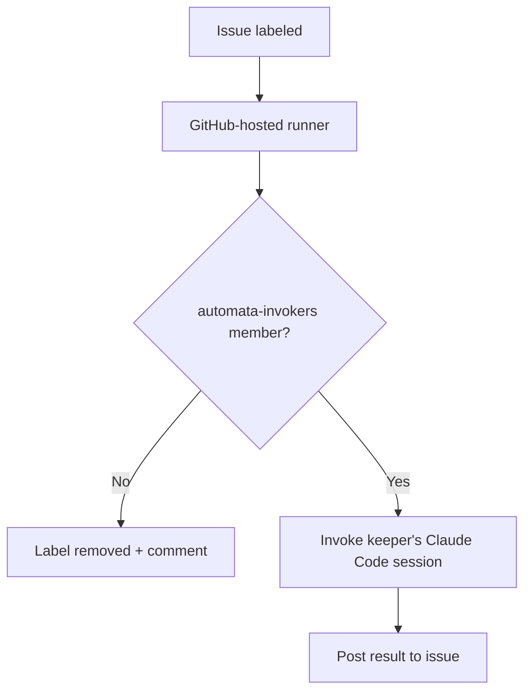
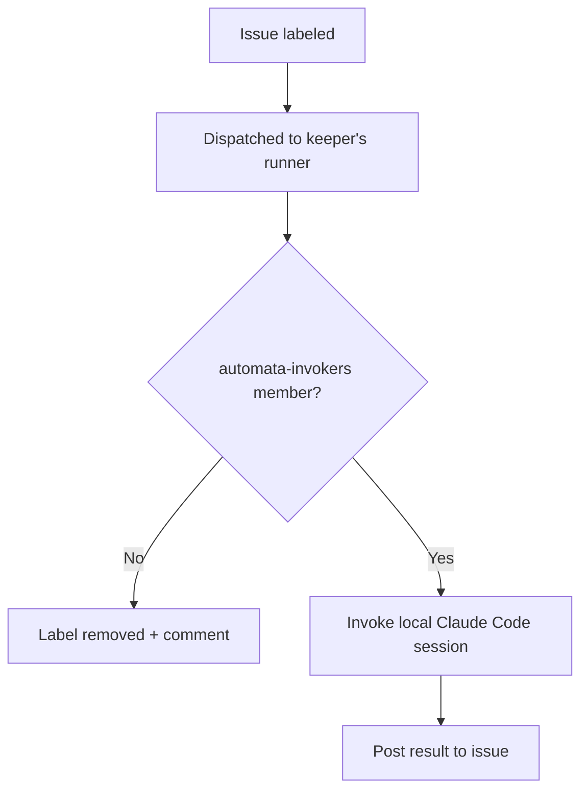

# Design Options

The full record of architectural options evaluated for the Hall of Automata invocation system, and the reasoning behind the final choice.

---

## The problem

MockaSort Studio needed a way for org members to invoke named AI agents (automata) on GitHub issues, with:

- Per-keeper OAuth billing (each automaton's cost is traceable to a contributor's subscription)
- Authorization controls (not every org member can invoke every automaton)
- Consistent behavior across all automata
- Minimal infrastructure overhead
- Auditable invocation history

---

## Options evaluated

### Option A — GitHub Actions + environment secrets (chosen)

**Architecture:** GitHub-hosted runners handle orchestration. Per-invoker OAuth tokens stored as environment secrets in `invoker/<handle>` GitHub Environments; automata run under the pool-selected invoker's token. The Hall App (Members: read) checks team membership — no separate PAT required. Invocation is triggered by issue labels, `@hall-of-automata` comment, or PR review `@mention`.

**Authorization:** One GitHub team (`automata-invokers`) gates all automata. Membership check runs via the App's installation token; unauthorized invocations trigger a hard workflow failure.

```mermaid
flowchart TD
    A[Issue labeled] --> B[GitHub-hosted runner]
    B --> C{automata-invokers member?}
    C -- No --> D[Label removed + comment]
    C -- Yes --> E[Invoke keeper's Claude Code session]
    E --> F[Post result to issue]
```

**Pros:**
- Zero member infrastructure — no machine needs to be online
- Available 24/7, GitHub manages the compute
- Full audit trail in Actions logs and issue comments
- Simple to onboard new automata — submit character sheet, Old Major opens PR, merge
- Per-invoker OAuth tokens: billing is traceable to individual contributors
- Environments API allows usage variables to be updated without secrets rotation

**Cons:**
- OAuth tokens in environment secrets — visible to org admins, not physically on invoker's hardware
- GitHub-hosted runners are ephemeral — persistent state via Actions Cache and repo files
- Requires trust in org admins for secret custody

**Accepted tradeoffs:** Token custody is organizational, not physical. Mitigated by CODEOWNERS protection on workflow files and the assumption that org admins are trusted. Tokens auto-invalidate on re-issue. The convenience and availability advantages outweigh the custody tradeoff for this team.

---

### Option B — Self-hosted runners (evaluated, rejected)

**Architecture:** Each keeper registers their own machine or personal server as a GitHub Actions runner with a label matching their automaton name. The OAuth token lives on the keeper's machine as an environment variable — never touches GitHub secrets.

```mermaid
flowchart TD
    A[Issue labeled] --> B[Dispatched to keeper's runner]
    B --> C{automata-invokers member?}
    C -- No --> D[Label removed + comment]
    C -- Yes --> E[Invoke local Claude Code session]
    E --> F[Post result to issue]
```

**Pros:**
- OAuth token never leaves keeper's infrastructure — true physical custody
- No Actions minutes consumed
- Keeper has full control over the environment

**Cons:**
- Runner must be online — automaton availability tied to keeper machine uptime
- Setup overhead per keeper (runner registration, systemd/launchd, maintenance)
- Self-hosted runners on any repo accessible to org members can execute code on keeper's machine — significant security surface even on private repos
- Token updates require updating keeper's local env rather than an environment secret

**Rejection reason:** Availability is a hard requirement. Automata that go offline when a keeper's laptop sleeps are not reliable org infrastructure. The security surface of self-hosted runners was also a concern. The token custody advantage does not outweigh these costs for this team size.

---

### Option C — Personal webhooks (evaluated, not pursued)

**Architecture:** Each keeper runs a persistent listener process (local or personal VPS) that watches GitHub webhook events. On matching tag, triggers local Claude Code session.

**Pros:**
- Maximum autonomy — no GitHub Actions dependency
- Full local context available

**Cons:**
- Most infrastructure per person
- No centralized audit trail
- Webhook management complexity
- No native GitHub issue integration without custom code

**Rejection reason:** The infrastructure overhead is disproportionate to the problem. GitHub Actions already provides the orchestration layer we need. Building a parallel system around webhooks is complexity with no compensating benefit at this scale.

---

## Final decision

**Option A.** The availability and simplicity advantages are decisive. Token custody in environment secrets is an accepted tradeoff, managed through CODEOWNERS protection on workflow files and org admin trust.

The full security posture for Option A is documented in [`security.md`](security.md).
