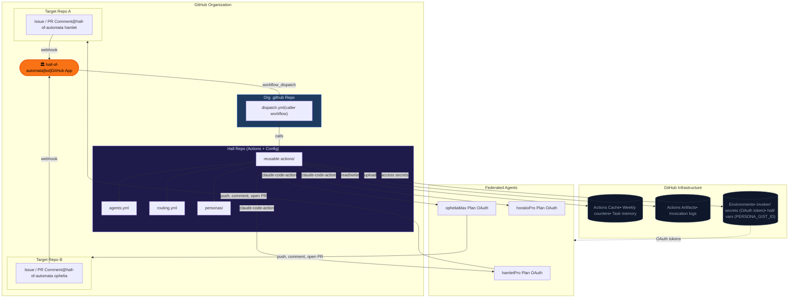
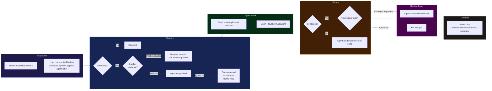
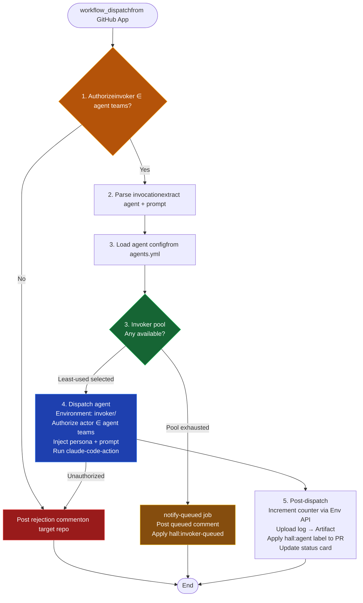
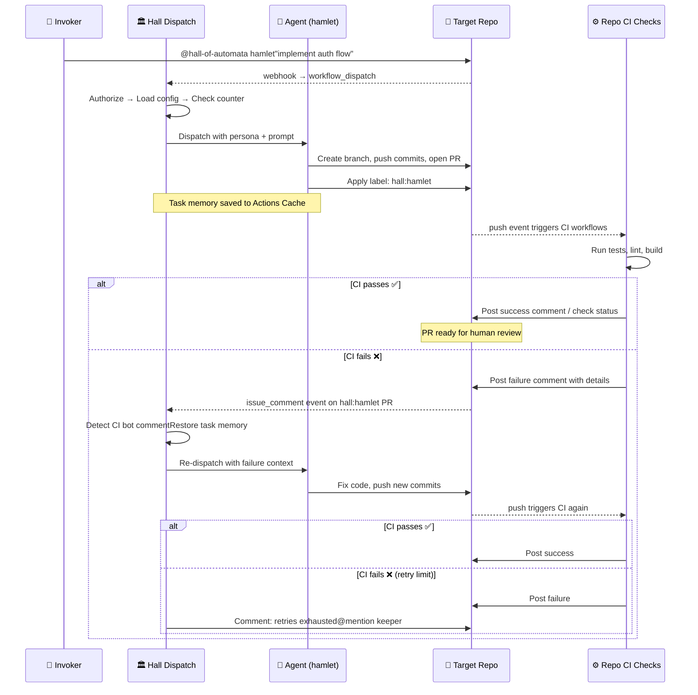
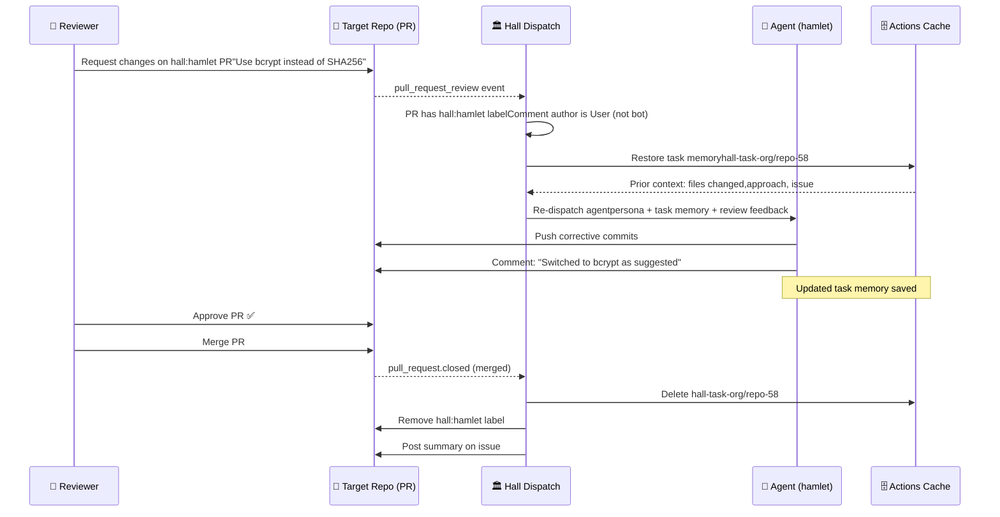
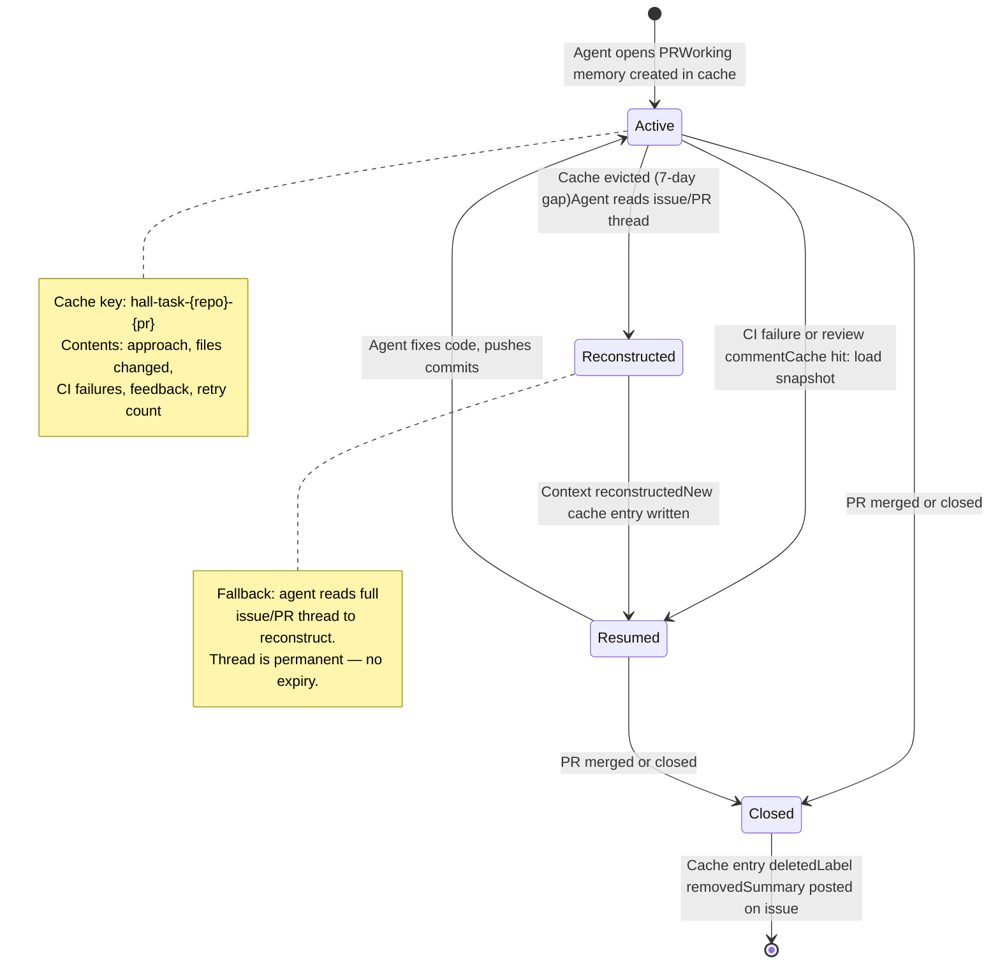

# Hall of Automata — Design Document

**Status:** Draft\
**Authors:** Hamlet 🐗\
**Reviewer** [The lore-keeper](https://github.com/mksetaro)  
**Version:** 1.0\
**Date:** March 2026


## Review comments are inputs for post 1.0 version. That is: ignore the comments until tag 1.0 is pushed

## 1. Problem Statement

Modern software teams increasingly rely on AI coding agents for implementation, review, and maintenance tasks. Today, using Claude as an automated agent in GitHub workflows requires each individual to hold a separate API billing account — even if they already pay for a Claude Pro or Max subscription. This creates three problems.

First, cost duplication. Contributors who already pay $20–200/month for Claude subscriptions must pay again for API access to automate the same model in CI/CD. There is no native way to pool subscription quota across a team for shared automation.

Second, fragmented agent identity. When multiple team members run Claude agents through GitHub Actions, each invocation appears as the generic `github-actions[bot]`. There is no unified identity, no shared history, and no way to tell which agent (or whose quota) handled a given task.

Third, uncontrolled consumption. Without centralized tracking, a single automated workflow can silently exhaust a contributor's entire weekly quota — leaving them unable to use Claude interactively for their own work. There is no cap enforcement, no routing intelligence, and no visibility into how shared quota is being consumed.

Hall of Automata solves these problems by introducing a federated agent orchestration layer built as a GitHub App. Contributors donate their Claude subscription quota to a shared pool. The Hall dispatches agents on demand, tracks consumption, enforces caps, and provides a unified bot identity across the organization — all without requiring a single API key.

---

## 2. Core Idea

Hall of Automata is a GitHub App installed at the organization level. It acts as the single portal through which federated Claude agents are dispatched to any repository in the org.

The interaction model is simple: a team member comments `@hall-of-automata <agent>` on an issue or pull request, or applies a GitHub label matching the agent's name to the issue. The issue body or PR comment provides all the context the agent needs. The Hall validates the invoker's authorization, selects the right agent and its federated OAuth token, and dispatches a Claude Code Action against the target repository. The agent works, opens a PR, and the Hall applies a label (e.g., `hall:hamlet`) to bind all subsequent interactions — CI results, reviewer feedback, follow-up comments — to that agent for the PR's lifetime. When the PR is merged, the label is removed and the agent's context is cleaned up.

All agent definitions, personas, routing rules, and reusable dispatch actions live in the Hall repository. The dispatch entry-point workflow lives in the org's `.github` repo and calls the Hall's actions. Target repositories require only the app installation — no local configuration.

### Architecture Overview



The Hall tracks weekly invocations against a pre-registered invoker pool. Each contributor donates quota from their Claude Pro/Max subscription by registering as an invoker. At dispatch time, the Hall's detect job queries all registered invoker environments via the REST API, reads `HALL_USAGE_COUNT` and `HALL_WEEKLY_CAP` for each, filters out over-cap members, and selects the least-used eligible invoker. Automatic rerouting to a different *agent* when the desired agent's invokers are exhausted is planned for Phase C-4.

---

## 3. Use Cases

### UC-1: On-Demand Implementation

A developer creates a GitHub issue and either assigns it to `@hall-of-automata` (unlabeled path) or applies a `hall:<agent>` label directly (directed path).

**Directed path (label trigger):** The developer applies `hall:hamlet` to the issue. The Hall validates authorization and dispatches the named agent directly. No triage step.

**Unlabeled path (assignment trigger):** The developer assigns the issue to `@hall-of-automata` without specifying an agent. The Hall dispatches Old Major, who reads the roster catalog from the `hall/roster` deployment, analyzes the issue, selects the most capable available agent (accounting for keeper usage counts), synthesizes the task context, and triggers the specialist dispatch. If Old Major cannot map the request to a specific agent with sufficient confidence, it posts a clarifying question on the issue and enters the awaiting-input state.

In both paths: the agent implements the feature, opens a PR linked to the issue, and the Hall applies a `hall:<agent>` label to bind all subsequent interactions.
**Advice/research path:** If the dispatched agent determines that the task does not require a code change (e.g., a question, a design review, or a research request), it posts a response comment on the issue and writes `comment_posted` to the dispatch result. No PR is opened. The status card updates to "Response posted" and no `hall:awaiting-input` label is applied — the conversation is complete.
### UC-2: Agent Reacts to PR Review

A reviewer requests changes on an agent-authored PR. Because the PR carries the `hall:hamlet` label, the Hall routes the review comment back to the same agent. The agent reads the feedback, makes corrections, and pushes new commits. The reviewer sees the updates and can approve or request further changes.

### UC-3: Agent Orchestrates CI Checks

After pushing code, the agent comments on the PR to trigger the repository's existing CI workflow (e.g., `/run-checks`). When CI completes and posts its results as a PR comment, the Hall detects the comment, identifies it as a CI result (via a known comment pattern or bot identity), and re-dispatches the same agent with the failure context. The agent reads the errors, fixes the code, pushes again, and re-triggers checks. This loop repeats up to a configurable retry limit.

### UC-4: Cap-Based Automatic Routing

The weekly cap is tracked per invoker — each contributor in the pool who has donated their Claude Pro/Max OAuth token. Each invoker environment (`invoker/<handle>`) stores the current usage (`HALL_USAGE_COUNT`) and cap (`HALL_WEEKLY_CAP`) as plain environment variables.

At dispatch time, the `detect` job queries all `invoker/*` environments via the REST API (using the app token), reads usage and cap for each, filters out over-cap members, and selects the least-used eligible invoker (ascending sort by `HALL_USAGE_COUNT`). If no invoker has remaining capacity, the `notify-queued` job posts a pool-exhausted comment and applies `hall:invoker-queued`. The dispatch job does not run. Automatic rerouting to a different *agent* when the desired agent's pool is exhausted is planned for Phase C-4.


### UC-5: Task Cleanup on Merge

When the agent's PR is merged, a workflow fires that: deletes the task memory cache entry, removes the `hall:<agent>` label from the PR, posts a mandatory summary comment on the originating issue (the comment is not optional), and appends a completed-task entry to the agent's dashboard gist.


### UC-6: Queued Task on Full Capacity

Two distinct queued scenarios exist:

**Onboarding-time:** The invoker's token probe returns HTTP 429 (quota exhausted but token valid). Both `hall:active-invoker` and `hall:invoker-queued` labels are applied. The issue is closed with a "queued" message. The invoker is registered and will dispatch as soon as quota resets.

**Dispatch-time (pool exhausted):** The entire invoker pool is at cap when a dispatch is attempted. The `detect` job finds no eligible invoker; the `notify-queued` job posts a pool-exhausted comment and applies `hall:invoker-queued`. The dispatch job does not run.

**Dispatch-time (Claude API quota):** The agent hits Claude API quota mid-dispatch and writes `quota_exceeded` to `.hall/dispatch-result.json`. The post-dispatch step posts a "quota hit — queuing task" comment, applies `hall:queued`, and updates the status card. A nightly job (`retry-queued.yml`, 03:00 UTC) finds all open issues labeled `hall:queued`, removes the label, and cycles the bound agent label to re-trigger `invoke.yml`. If the retry also hits quota, the agent writes `quota_exceeded` again, `hall:queued` is re-applied, and the next nightly run picks it up. No loop — one attempt per nightly run.

In all cases the weekly-reset workflow zeroes `HALL_USAGE_COUNT` every Monday 00:00 UTC.


### End-to-End Lifecycle



---

## 4. Requirements

### 4.1 Functional Requirements

**FR-1: Invocation.** The system must support two invocation paths: (a) directed — a `hall:<agent>` label is applied to an issue or PR, dispatching the named agent directly; (b) unlabeled — the issue or PR is assigned to `@hall-of-automata`, triggering Old Major to read the roster catalog, select the appropriate agent, and dispatch it with synthesized task context.

**FR-2: Authorization.** The system must validate that the invoker is a member of at least one GitHub team authorized for the requested agent before any workflow logic executes. Unauthorized invocations must result in a hard workflow failure, a verbose rejection comment tagging the `@automata-invokers` team, and no further action.

**FR-3: Agent Resolution.** On the directed path, the agent is resolved from the label name. On the unlabeled path, Old Major resolves the agent by reading the roster catalog from the `hall/roster` deployment and matching task characteristics against each agent's `roles`, `domains`, and `scope_summary`. Resolution includes a keeper usage check; agents whose keeper is at cap are excluded.

**FR-4: Dispatch.** The system must invoke the Claude Code Action with the resolved agent's OAuth token and synthesized context (base contract + persona from gist + task context from Old Major), targeting the repository where the invocation occurred.

**FR-5: PR Labeling.** When an agent opens a PR, the system must apply a GitHub label (e.g., `hall:hamlet`) that binds all subsequent PR events (review comments, CI results) to the same agent for the lifetime of that PR.

**FR-6: CI Orchestration.** The agent must be re-dispatched when CI failures are detected on its labeled PR, with the failure context included in the prompt. The agent operates within the target repository's existing CI infrastructure.

**FR-7: Review Interaction.** When a reviewer posts comments or requests changes on an agent-labeled PR, the bound agent must be re-dispatched with the review context to address feedback.

**FR-8: Invoker Usage Tracking.** The system must track weekly invocation count per invoker environment via `HALL_USAGE_COUNT` environment variable in `invoker/<handle>` (updated via the GitHub Environments API after each successful dispatch). Configurable cap is stored as `HALL_WEEKLY_CAP` on the same environment. At dispatch time, the `detect` job queries all `invoker/*` environments via REST API, reads `HALL_USAGE_COUNT` and `HALL_WEEKLY_CAP` for each, excludes over-cap members, and selects the least-used eligible invoker. Pool exhaustion (all at cap) triggers the `notify-queued` job.

**FR-9: Automatic Routing (deferred — Phase C-4).** When an invoker's cap is reached, the system queues the request and posts a cap-exceeded comment. Automatic rerouting to the least-used eligible agent based on domain and role overlap is planned for Phase C-4. On the unlabeled path (Old Major triage), routing will be part of the triage step; Old Major will read invoker usage counts and exclude fully-capped invokers. The `routing.yml` `strategy: least_used` field is the declared intent; it is not yet evaluated at runtime.

**FR-10: Task Memory.** The agent must persist task-specific working memory in Actions Cache, keyed by `hall-task-{repo}-{pr}`. The cache is the concurrency-safe working store; the issue/PR thread is the permanent fallback. On cache miss, the agent reconstructs context from the thread.

**FR-11: Cleanup.** On PR close (merged or not), the system must delete the task memory cache, remove the `hall:<agent>` label, post a **mandatory** summary comment on the originating issue, and append a completed-task entry to the agent's dashboard gist.

**FR-12: Immutable target CLAUDE.md.** The target repository's `CLAUDE.md` must never be committed to or modified. At dispatch time it is stashed as `.hall-local.md`. The agent reads it to extract hard constraints but does not modify or commit it.

**FR-13: No permanent Hall content in target repo.** Agent persona and task context are ephemeral: assembled in the runner workspace for the duration of the dispatch job and never committed. `CLAUDE.md` and all `.hall-*` files are excluded from commits by the base contract.

**FR-14: Persona format.** All automaton personas must follow the character sheet format defined in `agents/automaton_template.md`: three sections (Character, Domains, Scope) with no tool enumeration. The base contract (`agents/automaton_base.md`) is prepended to every persona at dispatch time.

**FR-15: Persona creation via onboarding workflow.** New automaton personas are submitted via a dedicated issue template. Old Major reviews the submission, verifies format compliance, creates the keeper environment, provisions the deployment and gists, and registers the automaton in the roster catalog. Roster changes are accepted only by `automata-invokers`.

**FR-16: Co-authorship.** Every commit made by an automaton must include a `Co-authored-by` trailer with the automaton's name and the Hall bot email (`hall-of-automata[bot]@users.noreply.github.com`).

**FR-17: Unauthorized invocation = hard failure.** An unauthorized invocation must cause the workflow to fail (non-zero exit), post a verbose rejection comment tagging both the invoker and `@<org>/automata-invokers`, and leave no other trace (no status card, no counter increment, no label remaining).

**FR-18: Org roster with hall fallback.** The roster catalog deployment may optionally be sourced from a dedicated org roster repository (configurable via a repo variable). If the org roster repo does not exist or is unreachable, the Hall's own `hall/roster` deployment is used as the fallback.

**FR-19: Invoker token validation via API probe.** During invoker onboarding, the token must be validated by a direct HTTP probe to the Anthropic API (`POST /v1/messages`, `max_tokens: 1`), not by a full Claude Code Action invocation. The HTTP response code is the sole signal: `200` = valid and active; `429` = valid but quota exhausted; `401`/`403` = invalid or expired; `5xx`/timeout = inconclusive (treated as pass with a workflow warning to avoid blocking a valid invoker on infra issues). No checkout of the Hall repo and no App token are required for this step.

**FR-20: Invoker onboarding — quota-exhausted queued state.** When the token probe returns HTTP 429, the invoker is fully onboarded (token is genuine) but placed in a queued state. Both `hall:active-invoker` and `hall:invoker-queued` labels must be applied. The onboarding issue must be closed with a dedicated "queued" comment (not a welcome comment and not a retry prompt). The `hall:invoker-queued` label signals the weekly-reset workflow to track pending activation.

**FR-21: Agent-declared dispatch outcome contract.** At the end of every invocation, the agent must write `.hall/dispatch-result.json` containing `outcome` (one of `pr_created`, `awaiting_input`, `comment_posted`, `quota_exceeded`, `failed`), `pr_number`, and `branch`. CI reads this file first to determine the post-dispatch status card stage; if absent, it falls back to API-based PR discovery. The file is ephemeral — excluded from commits by the base contract.

**FR-22: Comment-posted dispatch outcome.** When an agent completes a task by posting a response on the issue without opening a PR (advice, research, or design review), it must write `comment_posted` to the dispatch result. The status card updates to "Response posted". No `hall:awaiting-input` label is applied. The dispatch is considered complete.

### 4.2 Non-Functional Requirements

**NFR-1: No runtime artifacts in the Hall repo.** All runtime state must be stored in GitHub infrastructure: Actions Cache for task working memory; GitHub Deployments for automaton lifecycle metadata; GitHub Gists for persona and dashboard HMI content; Environment Variables for keeper usage and cap tracking. The Hall repo contains only code, configuration schemas, the base contract, and Old Major's persona.

**NFR-2: Org-scoped.** The app must be installable at the organization level and operate across all repositories where it is installed.

**NFR-3: Secret isolation.** Each agent's OAuth token must be stored in a dedicated GitHub Environment in the Hall repo, not as a repo-level secret.

**NFR-4: Naming independence.** Agent naming, identities, and trust are governed by the federation contract, which is outside the scope of this system. The Hall treats agent identifiers as opaque labels resolved through the registry.

**NFR-5: Claude Code compatibility.** The system targets Claude Pro/Max subscriptions authenticated via OAuth tokens (`claude setup-token`), not Claude API keys. All agent invocations must use the Claude Code Action's `claude_code_oauth_token` input.

**NFR-6: Audit trail.** Every invocation must produce an immutable artifact containing the agent identifier, invoker, target repo, timestamp, outcome, and resource consumption.

---

## 5. System Design

### 5.1 GitHub App

The app is the Hall's identity on GitHub. It is registered as a GitHub App at the organization level with the following configuration.

**Identity:** The app has a custom name ("Hall of Automata") and avatar. All comments and status updates posted through the app's installation token appear as `hall-of-automata[bot]`.

**Webhook events subscribed:** `issue_comment`, `pull_request_review_comment`, `pull_request_review`, `issues` (for label application and assignment), `check_suite`, `pull_request` (for merge detection and label changes).

**Permissions:** Expand the table below — it mirrors the GitHub App settings UI exactly so you can set permissions without guessing.

<details>
<summary><strong>Repository permissions</strong></summary>

| Permission | Access | Why |
|---|---|---|
| **Actions** | Read | Read workflow run status for CI loop detection |
| **Checks** | Read | Read check suite results on `hall/*` branches |
| **Contents** | Read & Write | Create branches, push commits to target repos |
| **Issues** | Read & Write | Read issue body; post comments; manage labels |
| **Metadata** | Read | Required by GitHub for all Apps |
| **Pull requests** | Read & Write | Open PRs, post review responses, read PR context |
| **Commit statuses** | Read | Read commit status for CI failure detection |

</details>

<details>
<summary><strong>Organization permissions</strong></summary>

| Permission | Access | Why |
|---|---|---|
| **Members** | Read | Check team membership for invoker authorization |

</details>

<details>
<summary><strong>Account permissions</strong></summary>

None required.

</details>

<details>
<summary><strong>Webhook events</strong></summary>

| Event | Why |
|---|---|
| `issue_comment` | Detect `@mention` invocations and awaiting-input re-dispatch |
| `issues` | Detect `hall:{agent}` label application |
| `pull_request_review` | Detect review-triggered re-dispatch |
| `check_suite` | Detect CI failures on `hall/*` branches for the CI loop |
| `pull_request` | Detect PR close/merge for cleanup |

</details>

**Webhook relay:** The app receives events and triggers `workflow_dispatch` on the org's `.github` repo dispatch workflow, forwarding the event payload as inputs. The caller workflow in the `.github` repo invokes reusable actions defined in the Hall repo. This separates the dispatch entry point (org-owned) from the implementation (Hall-owned), keeping org-specific configuration local while the Hall repo remains a stable, shared action library.

### 5.2 Dispatch Workflow

The dispatch workflow is the central orchestrator. It runs in two layers: a thin caller workflow in the org's `.github` repo receives the `workflow_dispatch` trigger from the App and invokes reusable composite actions defined in the Hall repo. All orchestration logic lives in the Hall repo's reusable actions; the `.github` caller only wires inputs and secrets through.



**Step 1 — Detect context + select invoker.** The `detect` job resolves the trigger event (label / comment / PR review) to: agent identifier, actor (the GitHub user who triggered the event), target repo, and issue/PR number. It then queries all `invoker/*` GitHub Environments via REST API using the App token, reads `HALL_USAGE_COUNT` and `HALL_WEEKLY_CAP` for each, filters out at-cap members, and selects the invoker with the lowest count. The selected invoker's handle and current count are passed as job outputs. If no invoker is available, the `notify-queued` job posts a pool-exhausted comment and applies `hall:invoker-queued`; dispatch does not run.

**Step 2 — Parse invocation.** The agent identifier comes from the label name (directed path) or from the `@mention` body (comment path). The issue or PR body and prior thread provide task context.

**Step 3 — Load agent config.** Read `agents.yml` from the Hall repo. Resolve the agent identifier to: authorized teams, persona gist (via `PERSONA_GIST_ID` variable in `hall/<agent>` env), max turns, and retry limit.

**Step 4 — Dispatch agent.** The `dispatch` job runs in `environment: invoker/<handle>` so `secrets.CLAUDE_CODE_OAUTH_TOKEN` resolves from the pool-selected invoker's environment. Authorization of the *actor* (who triggered the event) against the agent's teams list is the first step inside the dispatch job — hard fail if unauthorized. The target repository is checked out, the agent persona is injected as `CLAUDE.md` (fetched from gist via `PERSONA_GIST_ID` for automata; from `roster/old-major.md` for Old Major), and `anthropics/claude-code-action@v1` runs with the OAuth token and prompt.

**Step 5 — Post-dispatch.** Increment the invoker counter via `PATCH /environments/invoker%2F{handle}/variables/HALL_USAGE_COUNT`. Upload the invocation log as an Actions Artifact. If the agent opened a PR, apply the `hall:<agent>` label to bind future events. Agent declares its outcome in `.hall/dispatch-result.json` (outcome: `pr_created | awaiting_input | comment_posted | quota_exceeded | failed`); post-dispatch reads this file to determine the status card stage.

### 5.3 CI Orchestration Loop

The agent does not own CI. The target repository has its own check workflows — linters, tests, builds — that run on push or on PR events. The agent's role is to trigger these checks and react to their outcomes.



**Triggering checks.** When the agent pushes commits or opens a PR, the target repo's existing CI workflows fire automatically (on `push` or `pull_request` events). If the repo uses comment-triggered checks (e.g., `/run-checks`), the agent posts that comment.

**Review comment:** it's not very clear how checks interaction happens, do we give the agent capability to run checks through gh or we set a standard trigger which must be enforced org-wide? That also means that issue context must provide also checks instruction or pr template should. Keep in mind that some repo may not have checks

**Reacting to results.** CI workflows post their results — either as PR comments (from a CI bot), as check suite conclusions, or as commit statuses. The Hall's dispatch workflow listens for these signals on agent-labeled PRs.

When a CI result arrives on a PR labeled `hall:<agent>`:

1. The dispatch workflow identifies the bound agent from the label.
2. It restores the agent's task memory from Actions Cache (keyed by PR number).
3. It re-dispatches the same agent with the CI failure output appended to the prompt.
4. The agent reads the errors, fixes the code, and pushes new commits.
5. CI fires again on the new push.

This loop repeats up to `max_retries` (configured per agent in `agents.yml`). If retries are exhausted, the Hall posts a PR comment `@mentioning` the keeper (configured per agent in `agents.yml`) with the last failure context, and updates the issue status card to `Escalated`.

**Distinguishing CI comments from human comments.** The dispatch workflow must only re-dispatch on CI results, not on every PR comment. This is done by filtering on the comment author's identity (e.g., `github-actions[bot]`, a known CI app login) or by matching a hidden HTML marker pattern (e.g., `<!-- ci-result -->`) that the CI workflow includes in its output.

### 5.4 Review Interaction Loop

When a human reviewer posts a comment or submits a review on an agent-labeled PR:



1. The dispatch workflow detects the event on a `hall:<agent>` labeled PR.
2. It filters out bot comments (only reacts to `user.type == 'User'` or known reviewer bots).
3. It restores the agent's task memory from cache.
4. It re-dispatches the bound agent with the review feedback as context.
5. The agent addresses the feedback, pushes commits, and the reviewer is notified.

The agent maintains continuity across these interactions through task memory, described in Section 5.5.

### 5.5 Task Memory and Cleanup

Task memory operates in two layers with distinct roles and lifecycles.

**Layer 1 — Actions Cache (working memory).** A per-task cache entry keyed by `hall-task-{repo}-{pr_number}` stores the agent's structured working state: current approach, files modified, CI failure history, and review feedback. This is a compact, machine-readable snapshot optimized for fast load on re-dispatch. It is written at the end of each dispatch cycle and restored at the start of the next.

GitHub evicts cache entries that have not been accessed for 7 days. This is acceptable: the working memory is a performance layer, not the source of truth. If the entry is evicted during a long async pause (e.g., the invoker takes a week to reply to an agent question), the agent reconstructs context from Layer 2.

**Layer 2 — Issue/PR thread (natural memory).** The complete history of every invocation, status update, clarification exchange, agent response, CI result, and review comment is recorded in the triggering issue or PR thread. This thread never expires. It is human-readable, accessible to anyone with repo access, and serves as the permanent audit trail and fallback context source.

On cache miss, the dispatch workflow passes the thread URL to the agent as part of the prompt. The agent reads the thread, reconstructs its working state, and continues. A new cache entry is written at the end of that dispatch cycle.

This design makes the full dispatch-to-merge flow resilient to async gaps of any duration. A task can be paused indefinitely while waiting for user input and will resume correctly regardless of cache state.



**Cleanup** is triggered by a `pull_request` event with action `closed` (merged or not). When a PR with a `hall:<agent>` label is closed:

1. The task memory cache entry is deleted.
2. The `hall:<agent>` label is removed from the PR.
3. If the PR was linked to an issue, an optional summary comment is posted on the issue.

The issue/PR thread is never modified on cleanup — it remains as the permanent history of the task.

### 5.6 Runtime State Storage

| State | Storage | Key / Location | Lifecycle |
|-------|---------|----------------|----------|
| Task working memory | Actions Cache | `hall-task-{repo}-{pr_number}` | Created on first dispatch, deleted on PR close. 7-day inactivity eviction; agent reconstructs from thread on miss. |
| Keeper usage count | Env Variable (`HALL_USAGE_COUNT`) | `invoker/<handle>` environment | Incremented via Environments API after each dispatch. Reset to 0 by `weekly-reset.yml` on Monday 00:00 UTC. |
| Keeper weekly cap | Env Variable (`HALL_WEEKLY_CAP`) | `invoker/<handle>` environment | Set at invoker onboarding. Updated manually by invoker or keeper admin. |
| Agent lifecycle (gist refs) | Deployment payload | `hall/<agent>` env — singleton deployment | Created at onboarding. Updated (not recreated) at each invocation. |
| Roster catalog | Deployment payload | `hall/roster` env — singleton deployment | Updated by Old Major on agent onboarding or persona change. |
| Agent persona | GitHub Gist | ID in deployment payload | Created at onboarding. Updated when persona is revised. |
| Agent dashboard | GitHub Gist | ID in deployment payload | Appended after each dispatch (audit entry) and on PR close (task summary). |
| Agent persona gist ID | Env Variable (`PERSONA_GIST_ID`) | `hall/<agent>` environment | Written by Old Major at automaton onboarding. Read via REST API at dispatch time. Not a secret; plain variables are API-readable with the app token. |
| OAuth tokens | GitHub Environment secret | `invoker/<handle>` env | Managed by the invoker. Donated to the Hall at invoker onboarding. Rotated via `claude setup-token`. |

---

## 6. UX/UI Considerations

Hall of Automata has no custom frontend. GitHub is the interface. The design principle is: every meaningful state transition must be visible on a GitHub surface that the relevant person would naturally navigate to, without requiring knowledge of the Hall's internals.

### 6.1 Entry Points and Phase Assignment

The Hall has two invocation entry points that determine which phase a task starts in.

**Issue entry point → begins at Phase 1.** A comment or label on an issue where no PR yet exists. The Hall works through Phase 1 (dispatch → analysis → optional clarification → working → PR open) before transitioning to Phase 2.

**PR entry point → begins at Phase 2.** A comment on an existing PR (e.g., invoking the Hall directly on a PR not originally authored by the Hall). There is no Phase 1. The Hall posts its status card directly on the PR and begins the CI/review loop immediately.

In both cases the GitHub Issues API is used identically — GitHub's data model treats PRs as issues, and `POST /repos/{owner}/{repo}/issues/{number}/comments` works for both. The Hall makes no distinction at the API layer.

### 6.2 Phase 1 — Issue as Dashboard

When invoked from an issue, the Hall immediately posts a **status card comment** on the issue. This is a single comment from `hall-of-automata[bot]`, edited in-place at each sub-stage transition. No new comments are posted for status updates. A hidden HTML marker (`<!-- hall-status -->`) allows the dispatch workflow to locate and overwrite it deterministically.

Phase 1 has four explicit sub-stages:

1. **Dispatching** — Hall validates the invoker, selects and configures the agent.
2. **Analyzing** — Agent reads the issue and codebase, assesses scope and feasibility.
3. **Awaiting input** _(conditional)_ — Agent determines it needs clarification and posts a question on the issue. The status card is updated. This state is indefinite: the Hall waits for a non-bot `issue_comment` event on the issue, then re-dispatches the agent with the full thread as context — including the user's reply. There is no timeout.
4. **Working (WIP)** — Agent has sufficient context and begins implementation on a branch.

All comments in the issue thread — agent questions, user replies, status card updates — are posted by `hall-of-automata[bot]` via the App installation token. Agent persona is expressed through comment content and `hall:{agent}` labels, not through separate GitHub accounts.

### 6.3 Phase 2 — PR as Dashboard

When the agent opens a PR (from Phase 1) or when the Hall is invoked directly on a PR (Phase 2 entry), the PR page becomes the primary working surface. The issue status card continues to be updated in-place on the issue thread throughout Phase 2 — it is the invoker's single-pane view of the task from start to finish. For PR-entry invocations (no issue exists), the status card is posted on the PR itself.

The Hall reads the repo's CI check runs to drive the fix loop; it does not create its own check runs. PR comments carry the agent-reviewer conversation.

### 6.4 The Status Card

```markdown
<!-- hall-status -->
### Hall — hamlet

| | |
|---|---|
| **Stage** | Analyzing... |
| **Dispatched** | 2026-03-06 14:22 UTC |
| **Branch** | — |
| **PR** | — |
```

Stage values across the full lifecycle:

| Sub-stage | Stage value |
|-----------|------------|
| Dispatching | Dispatching agent... |
| Analyzing | Analyzing... |
| Awaiting user input | Awaiting context — question posted |
| Working | Working — `hall/hamlet/issue-42` |
| PR opened | PR opened — #58 |
| CI fix loop active | CI fix in progress (attempt 2 / 3) |
| Retries exhausted | Escalated — @{keeper} notified |
| Response posted (advice/research) | Response posted |
| Quota exhausted | Queued — weekly quota reached |
| Agent error | Failed — see comments |
| PR merged | Done — PR #58 merged |

### 6.5 Escalation to Keeper

When `max_retries` is exhausted:

1. The status card is edited to `Escalated — @{keeper} notified`.
2. A PR comment `@mentions` the keeper with the last CI failure summary.

The keeper receives a GitHub notification, lands on the PR, and has the full thread history and the repo's CI check run results in the Checks tab. The keeper's GitHub handle is configured per agent in `agents.yml` (see Appendix C).

### 6.6 UI Summary

| Phase | Primary surface | Signal |
|-------|----------------|--------|
| Pre-PR (issue entry) | Issue thread | Status card, edited in-place |
| Awaiting input | Issue thread | Status card + agent question comment |
| PR open (either entry) | PR thread | Status card + CI check runs |
| PR conversation | PR comments | Agent reports, reviewer feedback |
| Escalation | PR comment | Keeper @mention |
| Done | Status card | Final stage value |

---

## 9. Appendix C: Agent Configuration Reference

### agents.yml

```yaml
# agents.yml is the registration record — not read at dispatch time.
# The runtime catalog lives in the hall/roster deployment payload.

agents:
  hamlet:
    display_name: "Hamlet \U0001F417"      # shown in status cards and comments
    agent_env: hall/hamlet                 # GitHub Environment: PERSONA_GIST_ID variable only
                                           # (OAuth token lives in invoker/<handle>; no usage counters here)
    keeper: mksetaro
    teams: [automata-invokers]
    max_turns: 40
    max_retries: 3
    catalog:
      roles: [implement, fix, refactor]   # functional position — maps to invocation modes
      domains: [cpp, build-systems, devops] # named capability bundles — imply toolset
      scope_summary: >                    # one-paragraph plain-language scope for Old Major
        Deep implementation in C++ and build systems. Strong on structural fixes,
        refactors, and CI configuration. Not the right call for UI, docs, or ops.
```

The `CLAUDE_CODE_OAUTH_TOKEN` secret name is a fixed convention for all agents — it is not repeated per entry. The agent's full persona lives in a GitHub Gist; the `persona_gist_id` is stored in the `hall/<agent>` deployment payload, not in `agents.yml`.

### routing.yml

```yaml
routing:
  reset_day: monday       # weekly-reset.yml zeros HALL_USAGE_COUNT every Monday 00:00 UTC
  fallback: queue         # queue | reject (when invoker cap is exceeded)
  strategy: least_used    # alternate key selection when routing is implemented (Phase C-4)
```

### Persona File (roster/hamlet.md)

Example:

```markdown
You are Hamlet, a full-stack implementation agent in the Hall of Automata.

Your responsibilities:
- Read the issue or task description carefully.
- Plan your approach before writing code.
- Implement the requested changes following the repo's existing patterns.
- Write or update tests for your changes.
- Open a PR linked to the originating issue.

When reacting to CI failures:
- Read the failure output carefully.
- Fix the root cause, do not suppress tests.
- Push corrective commits to the same branch.

When reacting to reviewer feedback:
- Address each comment individually.
- If you disagree with a suggestion, explain your reasoning.
- Push corrective commits and summarize what you changed.
```

---

## 10. Appendix D: Invocation Counter

Usage is stored as an environment variable `HALL_USAGE_COUNT` in the invoker's `invoker/<handle>` GitHub Environment. It is a plain integer, updated via `PATCH /repos/{owner}/{repo}/environments/{name}/variables/HALL_USAGE_COUNT` after each successful dispatch. The weekly-reset workflow (`weekly-reset.yml`) sets it back to `0` every Monday 00:00 UTC by iterating all `invoker/*` environments.

---

## 11. Appendix E: Invocation Audit Log Schema

Uploaded as an Actions Artifact per dispatch.

```json
{
  "agent_requested": "hamlet",
  "agent_dispatched": "hamlet",
  "rerouted": false,
  "repo": "org/target-repo",
  "issue": 42,
  "pr": 58,
  "invoker": "username",
  "team_validated": "core-devs",
  "timestamp_start": "2026-03-06T14:22:00Z",
  "timestamp_end": "2026-03-06T14:34:12Z",
  "turns_used": 12,
  "turns_max": 40,
  "retry_count": 0,
  "files_changed": ["src/auth/login.ts", "src/routes/api.ts"],
  "outcome": "pr_created",
  "weekly_count_after": 19
}
```