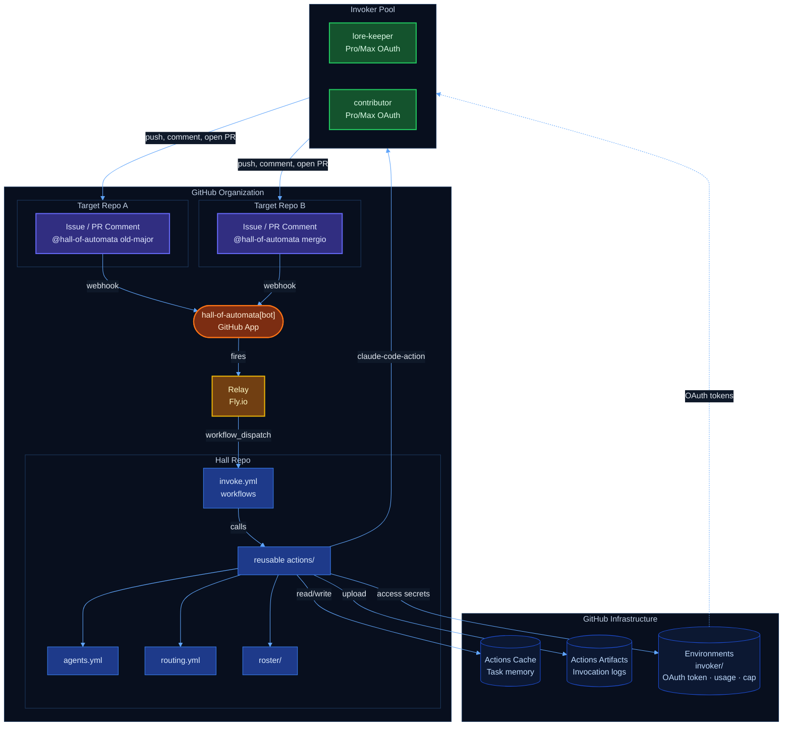
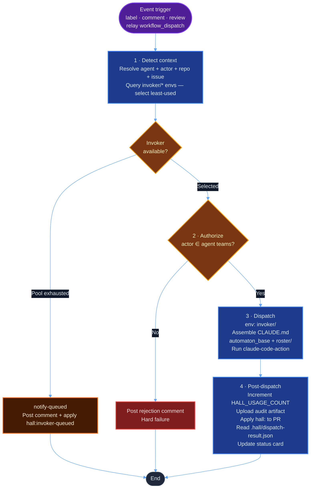

# Hall of Automata — Design Document

- **Status:** Draft
- **Authors:** Old Major 🐷
- **Reviewer:** [The lore-keeper](https://github.com/mksetaro)
- **Version:** 1.0
- **Date:** March 2026

---

## Architecture Overview



At dispatch time the `detect` job queries all `invoker/*` environments via REST API, reads `HALL_USAGE_COUNT` and `HALL_WEEKLY_CAP` per entry, excludes at-cap invokers, and selects the least-used eligible one. All agent invocations run under the selected invoker's OAuth token — agents do not hold their own credentials.

---

## Use Cases

### UC-1: On-Demand Dispatch

A user applies `hall:<agent>` to an issue (directed path) or assigns the issue to `@hall-of-automata` without specifying an agent (triage path).

- **Directed:** Named agent dispatched immediately after authorization.
- **Triage:** Old Major reads `agents.yml`, matches the issue against `catalog.domains` and `scope_summary`, applies the appropriate `hall:<agent>` label, and exits. The label fires a second dispatch to the resolved agent.
- **Advice/research:** If the agent determines no code change is needed, it posts a response comment and writes `comment_posted` to `.hall/dispatch-result.json`. Status card updates to `Response posted`. No PR is opened.

### UC-2: Iterative PR Work

Review feedback and CI failures on a `hall:<agent>`-labeled PR both re-dispatch the bound agent with the relevant context. The agent pushes corrective commits; CI reruns. If `max_retries` is exhausted, the Hall posts a PR comment `@mentioning` the invoker and updates the status card to `Escalated`.

---

## Requirements

### Functional

| ID | Requirement | Detail | Done |
|----|-------------|--------|:----:|
| FR-1 | **Invocation paths** | Label (`hall:<agent>` on issue/PR), comment (`@hall-of-automata <agent>`), or PR review triggers dispatch. On the triage path, Old Major resolves the agent from `agents.yml` and applies the label. | ✅ |
| FR-2 | **Authorization** | Actor must be a member of the agent's authorized `teams` list. Unauthorized invocations: hard workflow failure, rejection comment tagging `@automata-invokers`, no counter increment, no status card. | ✅ |
| FR-3 | **Invoker pool selection** | `detect` job queries all `invoker/*` environments, reads `HALL_USAGE_COUNT` / `HALL_WEEKLY_CAP`, excludes at-cap invokers, selects the lowest-count eligible invoker. Pool exhaustion: `notify-queued` posts comment and applies `hall:invoker-queued`; dispatch does not run. | ✅ |
| FR-4 | **Dispatch** | `dispatch` job runs under `environment: invoker/<handle>`. Persona assembled from `automaton_base.md` + `roster/<slug>.md` and written to `CLAUDE.md`. `anthropics/claude-code-action@v1` runs with `CLAUDE_CODE_OAUTH_TOKEN` and a prompt from issue/PR context and task memory. | ✅ |
| FR-5 | **PR labeling** | When an agent opens a PR, apply `hall:<agent>` to bind subsequent events (CI, review) to the same agent. | ✅ |
| FR-6 | **CI loop** | On CI failure on an agent-labeled PR: restore task memory, re-dispatch the agent with failure context. Repeat up to `max_retries`. On exhaustion: escalation comment `@mentioning` the invoker, status card `Escalated`. | ✅ |
| FR-7 | **Review loop** | Human review comments on an agent-labeled PR re-dispatch the bound agent with review context. | ✅ |
| FR-8 | **Usage tracking** | `HALL_USAGE_COUNT` (env var on `invoker/<handle>`) incremented via Environments API after each dispatch. `HALL_WEEKLY_CAP` set at onboarding. Configurable weekly-reset workflow. | ✅ |
| FR-9 | **Task memory** | Cache key `hall-task-{repo}-{pr}`. Written at dispatch end, restored at dispatch start. On 7-day eviction: agent reconstructs from issue/PR thread. | ✅ |
| FR-10 | **Cleanup** | On PR close: delete task memory cache entry, remove `hall:<agent>` label, post mandatory summary comment on originating issue. | ✅ |
| FR-11 | **Target repo contract** | `.hall-local.md` at repo root is owned by the automaton — holds dispatch log and accumulated context. Only `.hall-*` file the automaton may commit. The target repo's `CLAUDE.md` is read-only at dispatch time, never modified or committed. | ✅ |
| FR-12 | **Dispatch outcome contract** | Agent writes `.hall/dispatch-result.json` with `outcome` ∈ {`pr_created`, `awaiting_input`, `comment_posted`, `quota_exceeded`, `failed`}, `pr_number`, and `branch`. Post-dispatch reads this to drive the status card update. | ✅ |
| FR-13 | **Co-authorship** | Every automaton commit must include `Co-authored-by: <name> <hall-of-automata[bot]@users.noreply.github.com>`. | ✅ |
| FR-14 | **Token validation** | During onboarding: HTTP probe to Anthropic API (`POST /v1/messages`, `max_tokens: 1`). `200` = valid; `429` = valid but quota-exhausted; `401`/`403` = invalid; `5xx`/timeout = inconclusive (pass with warning). | ✅ |
| FR-15 | **Quota-exhausted onboarding** | HTTP 429 on probe: apply `hall:active-invoker` + `hall:invoker-queued`, close issue with queued message. Invoker is fully registered and activates on quota reset. | ✅ |

### Non-Functional

| ID | Requirement | Detail | Done |
|----|-------------|--------|:----:|
| NFR-1 | **No runtime artifacts in Hall repo** | Runtime state in GitHub infrastructure only: Actions Cache (task memory), Environment Variables (invoker counters and caps), Artifacts (audit logs). | ✅ |
| NFR-2 | **Org-scoped** | App installable at org level; operates across all installed repos. | ✅ |
| NFR-3 | **Secret isolation** | OAuth tokens stored as secrets in `invoker/<handle>` environments only — not as repo-level secrets. | ✅ |
| NFR-4 | **Claude OAuth** | Targets Claude Pro/Max subscriptions via `claude setup-token`. All dispatches use the `claude_code_oauth_token` action input. | ✅ |
| NFR-5 | **Audit trail** | Every dispatch produces an immutable Artifact with: agent, invoker, repo, timestamp, outcome, turns used. | ✅ |

---

## System Design

### GitHub App

**Identity:** `hall-of-automata[bot]`. Registered at org level. Webhook URL points to the relay on Fly.io.

#### Repository Permissions

| Permission | Access | Reason |
|---|---|---|
| Actions | Read & Write | Read CI run status; trigger `workflow_dispatch` via relay |
| Checks | Read | Read check suite results on `hall/*` branches |
| Contents | Read & Write | Create branches, push commits to target repos |
| Issues | Read & Write | Post comments, manage labels |
| Metadata | Read | Required by GitHub for all Apps |
| Pull requests | Read & Write | Open PRs, post review responses, read PR context |
| Commit statuses | Read | CI failure detection |

#### Organization Permissions

| Permission | Access | Reason |
|---|---|---|
| Members | Read | Team membership check for invoker authorization |

#### User Permissions

None required.

#### Webhook Events

| Event | Trigger |
|---|---|
| `issue_comment` | `@mention` invocations; awaiting-input re-dispatch |
| `issues` | `hall:<agent>` label application; assignment trigger |
| `pull_request_review` | Review-triggered agent re-dispatch |
| `check_suite` | CI failures on `hall/*` branches → CI loop |
| `pull_request` | PR close/merge → cleanup |

**Relay.** The App webhook URL points to a Node.js ESM service on Fly.io (`hall-relay`). The relay authenticates via GitHub App JWT → installation token (no PAT) and calls `workflow_dispatch` on the hall-of-automata `.github` repo. Events from the `hall-of-automata` repo itself bypass the relay (handled natively by `issues.labeled` / `issue_comment`).

### Dispatch Workflow



**Step 1 — Detect + select invoker.** Resolves trigger event (label / comment / PR review) to: agent identifier, actor, target repo, issue/PR number. Queries all `invoker/*` environments via REST API, reads usage/cap, selects least-used under-cap invoker.

**Step 2 — Authorize.** Actor's team membership verified against the agent's `teams` list in `agents.yml`. Hard fail if unauthorized.

**Step 3 — Dispatch.** Job runs in `environment: invoker/<handle>`. `CLAUDE.md` assembled from `agents/automaton_base.md` + `roster/<slug>.md`. `claude-code-action` runs with the invoker's `CLAUDE_CODE_OAUTH_TOKEN` and a prompt built from issue/PR context and restored task memory.

**Step 4 — Post-dispatch.** Counter incremented via Environments API. Audit artifact uploaded. Outcome read from `.hall/dispatch-result.json` to drive status card stage.

### CI Loop

`hall-ci-loop.yml` listens for `check_suite.completed` on `hall/*` branches. On failure: restores task memory from cache, re-dispatches the bound agent with failure output as context. The agent fixes code and pushes; CI reruns. Loop repeats up to `max_retries`. On exhaustion: escalation comment `@mentioning` the invoker + status card `Escalated`.

The agent does not own CI infrastructure. Checks trigger automatically on push for repos with `push`/`pull_request` CI triggers. Repos without CI: no loop runs.

### Review Loop

`pull_request_review` event on a `hall:<agent>`-labeled PR: dispatch workflow restores task memory, re-dispatches the bound agent with the review body as context. Bot-authored review events are filtered out; only `user.type == 'User'` triggers re-dispatch.

### Task Memory and Cleanup

**Working memory:** Actions Cache key `hall-task-{repo}-{pr}`. Written at dispatch end. Restored at dispatch start. On 7-day eviction: agent reconstructs context from the issue/PR thread (permanent fallback).

**Cleanup** (PR close): delete cache entry → remove `hall:<agent>` label → post mandatory summary comment on the originating issue.

### Runtime State

| State | Storage | Key | Lifecycle |
|---|---|---|---|
| Task memory | Actions Cache | `hall-task-{repo}-{pr}` | Created on first dispatch; deleted on PR close; 7-day eviction |
| Invoker usage | Env var `HALL_USAGE_COUNT` | `invoker/<handle>` | Incremented per dispatch; reset every Monday 00:00 UTC |
| Invoker cap | Env var `HALL_WEEKLY_CAP` | `invoker/<handle>` | Set at onboarding |
| OAuth tokens | Env secret `CLAUDE_CODE_OAUTH_TOKEN` | `invoker/<handle>` | Managed by invoker |
| Agent registry | Repo file `agents.yml` | — | Updated at onboarding |
| Agent personas | Repo files `roster/*.md` | — | Updated when revised |
| Audit logs | Actions Artifacts | `hall-log-{agent}-{issue}-{run_id}.json` | Per dispatch; GitHub default retention |

---

## Status Card

Single `<!-- hall-status -->` comment posted on the issue (or PR for PR-entry invocations), edited in-place at each stage transition. 

For example **Hall — mergio** can post:
<!-- hall-status -->
| Quest Tracker|  |
|---|---|
| **Stage** | Analyzing... |
| **Dispatched** | 2026-03-06 14:22 UTC |
| **Branch** | — |
| **PR** | — |


### Stage Legend

| Stage | Value |
|---|---|
| Queuing | `Dispatching agent...` |
| Analyzing | `Analyzing...` |
| Awaiting input | `Awaiting context — question posted` |
| Working | `Working — hall/mergio/issue-42` |
| PR opened | `PR opened — #58` |
| CI fix loop | `CI fix in progress (attempt N / max)` |
| Escalated | `Escalated — @{invoker} notified` |
| Advice done | `Response posted` |
| Quota hit | `Queued — weekly quota reached` |
| Failed | `Failed — see comments` |
| Merged | `Done — PR #58 merged` |

---

## Appendix A: Configuration Reference

### agents.yml

An example of an `agent.yml` of the automaton `mergio`:

```yaml
agents:
  mergio:
    display_name: "Mergio 🔧"
    author: mksetaro        # contributor who created this automaton
    invoker: mksetaro       # escalation target
    teams: [automata-invokers]
    max_turns: 20
    max_retries: 3
    catalog:
      roles: [implement, fix, review]
      domains: [ci-cd, github-actions, devops]
      scope_summary: >
        CI/CD architect — implements pipelines, fixes workflow failures, and enforces
        build hygiene in GitHub Actions-managed repositories.
```
*Note*: `CLAUDE_CODE_OAUTH_TOKEN` lives in `invoker/<handle>` environments — not in agent entries.

### routing.yml

```yaml
routing:
  reset_day: monday
  fallback: queue       # queue | reject
  strategy: least_used 
```

### Audit Log Schema

```json
{
  "agent_requested": "mergio",
  "agent_dispatched": "mergio",
  "repo": "org/target-repo",
  "issue": 42,
  "pr": 58,
  "invoker": "username",
  "team_validated": "automata-invokers",
  "timestamp_start": "2026-03-06T14:22:00Z",
  "timestamp_end": "2026-03-06T14:34:12Z",
  "turns_used": 12,
  "turns_max": 20,
  "retry_count": 0,
  "outcome": "pr_created",
  "weekly_count_after": 19
}
```
