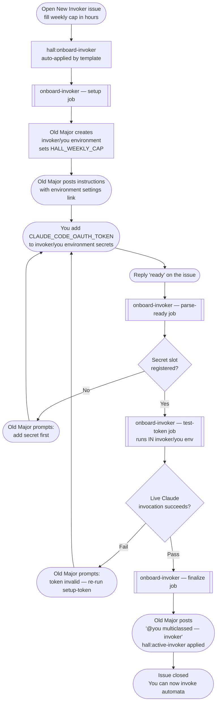

# Invoker Onboarding

An **invoker** is a contributor who has registered their Claude OAuth token with the Hall and been granted dispatch rights. Only invokers may trigger automata.

Registration validates the token with a live Claude invocation before granting access — a bad paste is caught before it causes a failed dispatch.

---

## Prerequisites

Complete both before opening the onboarding issue:

- [ ] Member of the `automata-invokers` GitHub team — ask an org admin
- [ ] `claude setup-token` completed locally — you should have received an OAuth token

---

## Process

---

## Why the live invocation test?

Secret name presence does not validate the token value. A token that was pasted incorrectly, truncated, or has already been revoked will register as a named secret but fail at dispatch time — wasting a turn and leaving an unhelpful error. The test-token job fires a minimal one-turn Claude call inside `invoker/<you>` before access is granted. Failure produces an actionable retry prompt, not a silent broken state.

---

## Weekly cap

The cap you provide in hours is converted to **turns** (1 hour ≈ 3 turns) and stored as `HALL_WEEKLY_CAP` in your environment. The counter resets every Monday. Old Major enforces the cap during unlabeled triage; labeled dispatches have their own pre-dispatch guard.

---

## Invoking an automaton

Once registered, apply a `hall:<agent>` label to any issue or PR in a target repository. The Hall checks your team membership on every dispatch.
