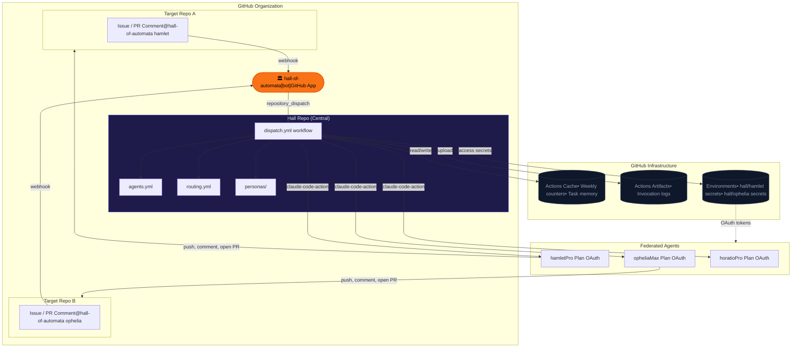
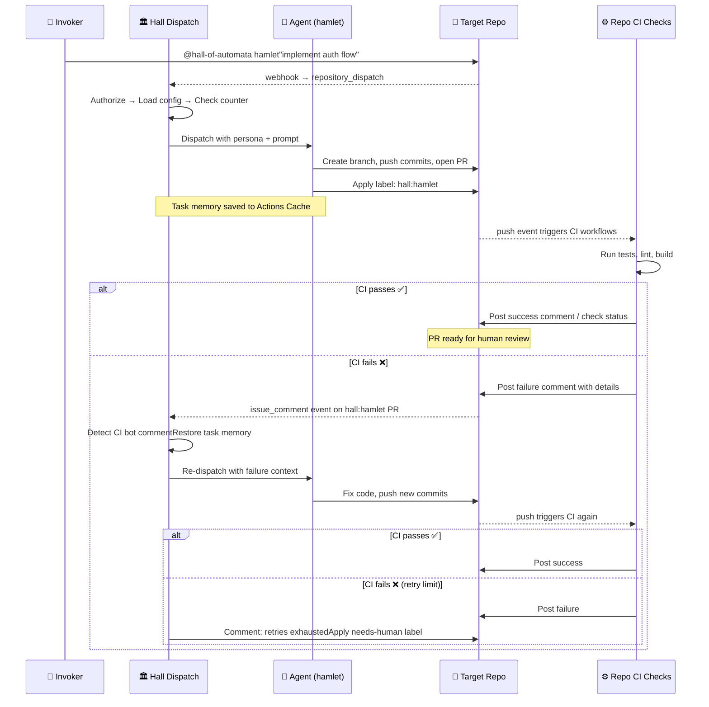
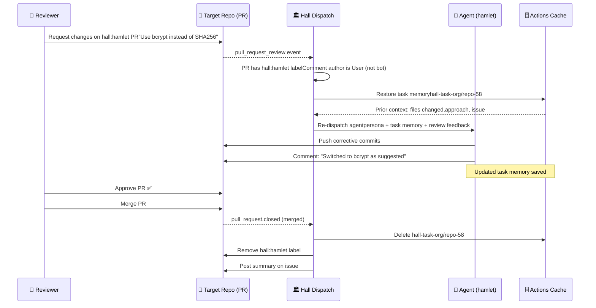
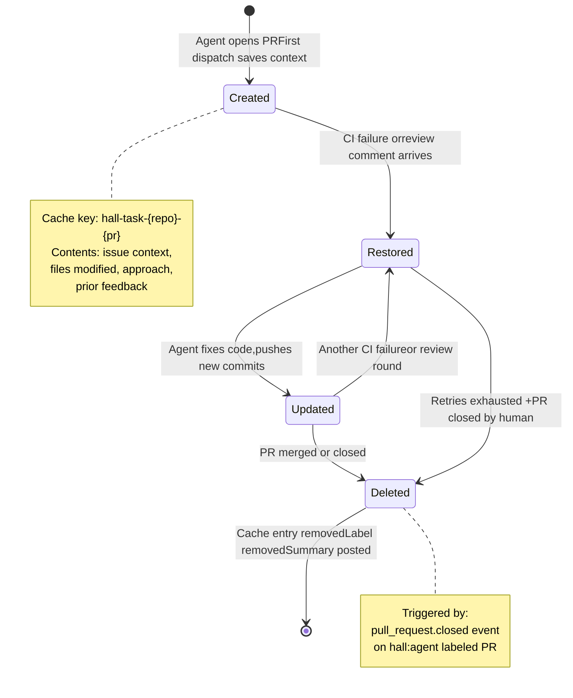

# Hall of Automata — Design Document

**Status:** Draft\
**Authors:** [The lore-keeper](https://github.com/mksetaro), Hamlet 🐗\
**Version:** 0.3\
**Date:** March 2026

## 1. Problem Statement

Modern software teams increasingly rely on AI coding agents for implementation, review, and maintenance tasks. Today, using Claude as an automated agent in GitHub workflows requires each individual to hold a separate API billing account — even if they already pay for a Claude Pro or Max subscription. This creates three problems.

First, cost duplication. Contributors who already pay $20–200/month for Claude subscriptions must pay again for API access to automate the same model in CI/CD. There is no native way to pool subscription quota across a team for shared automation.

Second, fragmented agent identity. When multiple team members run Claude agents through GitHub Actions, each invocation appears as the generic `github-actions[bot]`. There is no unified identity, no shared history, and no way to tell which agent (or whose quota) handled a given task.

Third, uncontrolled consumption. Without centralized tracking, a single automated workflow can silently exhaust a contributor's entire weekly quota — leaving them unable to use Claude interactively for their own work. There is no cap enforcement, no routing intelligence, and no visibility into how shared quota is being consumed.

Hall of Automata solves these problems by introducing a federated agent orchestration layer built as a GitHub App. Contributors donate their Claude subscription quota to a shared pool. The Hall dispatches agents on demand, tracks consumption, enforces caps, and provides a unified bot identity across the organization — all without requiring a single API key.

---

## 2. Core Idea

Hall of Automata is a GitHub App installed at the organization level. It acts as the single portal through which federated Claude agents are dispatched to any repository in the org.

The interaction model is simple: a team member comments `@hall-of-automata <agent>` on an issue or pull request, or applies a GitHub label matching the agent's name to the issue. The issue body or PR comment provides all the context the agent needs. The Hall validates the invoker's authorization, selects the right agent and its federated OAuth token, and dispatches a Claude Code Action against the target repository. The agent works, opens a PR, and the Hall applies a label (e.g., `hall:hamlet`) to bind all subsequent interactions — CI results, reviewer feedback, follow-up comments — to that agent for the PR's lifetime. When the PR is merged, the label is removed and the agent's context is cleaned up.

All agent definitions, personas, routing rules, and workflows live in a central Hall repository. Target repositories require only the app installation — no local configuration.

### Architecture Overview



The Hall tracks every invocation against a weekly counter per agent. When an agent exceeds its cap, the Hall automatically reroutes the task to the least-used eligible agent. This counter data enables future heuristics for intelligent routing without requiring any changes to the invocation interface.

---

## 3. Use Cases

### UC-1: On-Demand Implementation

A developer creates a GitHub issue describing a feature. They either comment `@hall-of-automata hamlet` on the issue or apply the `hamlet` label directly. The Hall validates the developer's team membership, dispatches the agent with the issue body as context, and the agent implements the feature, opens a PR linked to the issue. The Hall applies a `hall:hamlet` label to the PR so all subsequent interactions route back to the same agent.

### UC-2: Agent Reacts to PR Review

A reviewer requests changes on an agent-authored PR. Because the PR carries the `hall:hamlet` label, the Hall routes the review comment back to the same agent. The agent reads the feedback, makes corrections, and pushes new commits. The reviewer sees the updates and can approve or request further changes.

### UC-3: Agent Orchestrates CI Checks

After pushing code, the agent comments on the PR to trigger the repository's existing CI workflow (e.g., `/run-checks`). When CI completes and posts its results as a PR comment, the Hall detects the comment, identifies it as a CI result (via a known comment pattern or bot identity), and re-dispatches the same agent with the failure context. The agent reads the errors, fixes the code, pushes again, and re-triggers checks. This loop repeats up to a configurable retry limit.

### UC-4: Cap-Based Automatic Routing

A developer requests a specific agent, but that agent has hit its weekly cap of 40 invocations. The Hall checks routing rules, finds an alternate agent with capacity and overlapping capabilities, and dispatches the alternate instead. The invoker is notified of the reroute in the response comment.

### UC-5: Task Cleanup on Merge

When the agent's PR is merged, a workflow fires that cleans up the agent's task-specific cache (working memory for the issue), removes the `hall:<agent>` label, and optionally posts a summary comment on the original issue.

### UC-6: Queued Task on Full Capacity

All eligible agents are at their weekly cap. The Hall applies a `hall:queued` label to the issue, posts a comment explaining the delay, and a scheduled workflow re-dispatches the task when counters reset on the configured day.

### End-to-End Lifecycle

```mermaid
flowchart LR
    subgraph INVOKE["Invocation"]
        IS["Issue createdwith context"] --> MN["User comments@hall-of-automata agentor applies agent label"]
    end

    subgraph DISPATCH["Dispatch"]
        MN --> AU{"Authorized?"}
        AU -->|No| RJ["Rejected"]
        AU -->|Yes| CAP{"Under cap?"}
        CAP -->|Over| RT["Reroute / Queue"]
        CAP -->|Yes| AG["Agent dispatched"]
    end

    subgraph WORK["Agent Work"]
        AG --> IMPL["Read issueImplement solution"]
        IMPL --> PR["Open PRLabel: hall:agent"]
    end

    subgraph CILOOP["CI Loop"]
        PR --> CI{"CI passes?"}
        CI -->|Yes| REV
        CI -->|No| FIX["Agent reads failuresFixes code"] --> CI
    end

    subgraph REVIEW["Review Loop"]
        REV{"Reviewapproved?"} -->|Changes requested| ADDR["Agent addressesfeedback"] --> REV
        REV -->|Approved| MRG
    end

    subgraph CLOSE["Cleanup"]
        MRG["PR Merged"] --> CLN["Delete task memoryRemove labelPost summary"]
    end

    style INVOKE fill:#1e1b4b,stroke:#4338ca,color:#e0e7ff
    style DISPATCH fill:#172554,stroke:#2563eb,color:#dbeafe
    style WORK fill:#052e16,stroke:#16a34a,color:#dcfce7
    style CILOOP fill:#422006,stroke:#d97706,color:#fef3c7
    style REVIEW fill:#4a044e,stroke:#c026d3,color:#fae8ff
    style CLOSE fill:#1c1917,stroke:#78716c,color:#e7e5e4
```



---

## 4. Requirements

### 4.1 Functional Requirements

**FR-1: Invocation.** The system must dispatch an agent when (a) a comment containing `@hall-of-automata <agent>` is posted on an issue or PR, or (b) a GitHub label matching a registered agent name is applied to an issue, in any org repository where the app is installed.

**FR-2: Authorization.** The system must validate that the invoker is a member of at least one GitHub team authorized for the requested agent before any workflow logic executes. Unauthorized invocations must be rejected immediately with a clear response.

**FR-3: Agent Resolution.** The system must resolve the agent identifier (from mention or label) to a specific OAuth token and persona file defined in the Hall repository's agent registry.

**FR-4: Dispatch.** The system must invoke the Claude Code Action with the resolved agent's OAuth token and persona, targeting the repository where the mention occurred.

**FR-5: PR Labeling.** When an agent opens a PR, the system must apply a GitHub label (e.g., `hall:hamlet`) that binds all subsequent PR events (review comments, CI results) to the same agent for the lifetime of that PR.

**FR-6: CI Orchestration.** The agent must be able to trigger existing CI checks on the target repository (via comment or commit push) and must be re-dispatched when CI results are posted, with the failure context included in the prompt.

**FR-7: Review Interaction.** When a reviewer posts comments or requests changes on an agent-labeled PR, the bound agent must be re-dispatched with the review context to address feedback.

**FR-8: Weekly Counting.** The system must track the number of invocations per agent per week and enforce configurable caps.

**FR-9: Automatic Routing.** When the requested agent exceeds its weekly cap, the system must reroute to the least-used eligible agent based on capability match.

**FR-10: Task Memory.** The agent must be able to persist task-specific context (working memory) in Actions Cache for the duration of the task, keyed by issue/PR number. This memory must be cleaned up when the associated PR is merged.

**FR-11: Cleanup.** On PR merge, the system must delete the agent's task-specific cache, remove the `hall:<agent>` label, and optionally post a summary on the originating issue.

### 4.2 Non-Functional Requirements

**NFR-1: No runtime artifacts in the Hall repo.** All runtime state (counters, task memory, audit logs) must be stored in GitHub infrastructure: Actions Cache for mutable state, Actions Artifacts for immutable logs.

**NFR-2: Org-scoped.** The app must be installable at the organization level and operate across all repositories where it is installed.

**NFR-3: Secret isolation.** Each agent's OAuth token must be stored in a dedicated GitHub Environment in the Hall repo, not as a repo-level secret.

**NFR-4: Naming independence.** Agent naming, identities, and trust are governed by the federation contract, which is outside the scope of this system. The Hall treats agent identifiers as opaque labels resolved through the registry.

**NFR-5: Claude Code compatibility.** The system targets Claude Pro/Max subscriptions authenticated via OAuth tokens (`claude setup-token`), not Claude API keys. All agent invocations must use the Claude Code Action's `claude_code_oauth_token` input.

**NFR-6: Audit trail.** Every invocation must produce an immutable artifact containing the agent identifier, invoker, target repo, timestamp, outcome, and resource consumption.

---

## 5. System Design

### 5.1 GitHub App

The app is the Hall's identity on GitHub. It is registered as a GitHub App at the organization level with the following configuration.

**Identity:** The app has a custom name ("Hall of Automata") and avatar. All comments and status updates posted through the app's installation token appear as `hall-of-automata[bot]`.

**Webhook events subscribed:** `issue_comment`, `pull_request_review_comment`, `pull_request_review`, `issues` (for label application and assignment), `check_suite`, `pull_request` (for merge detection and label changes).

**Permissions:** Contents (read/write), Issues (read/write), Pull Requests (read/write), Members (read), Metadata (read), Statuses (read/write). Checks permission is discussed in Appendix B.

**Webhook relay:** The app receives events and triggers `repository_dispatch` on the Hall repo, forwarding the event payload. The Hall repo's dispatch workflow contains all orchestration logic.

### 5.2 Dispatch Workflow

The dispatch workflow is the central orchestrator. It runs in the Hall repo, triggered by `repository_dispatch` from the app's webhook relay.


**Step 1 — Authorization (gate).** Before any other logic, the workflow validates the invoker's GitHub team membership against the agent's authorized teams list. If unauthorized, the workflow posts a rejection comment on the target repo and exits. No counter is incremented. No cache is read. This is the first step, not an intermediate one.

**Step 2 — Parse invocation.** Extract the agent identifier and prompt from the comment body (if triggered by mention) or from the label name (if triggered by label application). The prompt is everything after the agent name in a mention, or the issue body for label-triggered dispatch. The issue or PR body provides additional context.

**Step 3 — Load agent config.** Read `agents.yml` from the Hall repo. Resolve the agent identifier to: OAuth token secret name, persona file path, authorized teams, capability list, max turns, and retry limit.

**Step 4 — Counter check.** Restore the weekly counter from Actions Cache. If the requested agent is under its cap, proceed. If over cap, apply the routing strategy from `routing.yml` to select an alternate agent. If all eligible agents are capped, queue the task (apply `hall:queued` label, post comment, exit).

**Step 5 — Dispatch agent.** The job references the agent's GitHub Environment (e.g., `hall/hamlet`) to access the isolated OAuth token. It checks out the target repository, injects the agent's persona, and runs `anthropics/claude-code-action@v1` with the OAuth token and prompt.

**Step 6 — Post-dispatch.** Increment the counter and save to Actions Cache. Upload the invocation log as an Actions Artifact. If the agent opened a PR, apply the `hall:<agent>` label to bind future events.

### 5.3 CI Orchestration Loop

The agent does not own CI. The target repository has its own check workflows — linters, tests, builds — that run on push or on PR events. The agent's role is to trigger these checks and react to their outcomes.



**Triggering checks.** When the agent pushes commits or opens a PR, the target repo's existing CI workflows fire automatically (on `push` or `pull_request` events). If the repo uses comment-triggered checks (e.g., `/run-checks`), the agent posts that comment.

**Reacting to results.** CI workflows post their results — either as PR comments (from a CI bot), as check suite conclusions, or as commit statuses. The Hall's dispatch workflow listens for these signals on agent-labeled PRs.

When a CI result arrives on a PR labeled `hall:<agent>`:

1. The dispatch workflow identifies the bound agent from the label.
2. It restores the agent's task memory from Actions Cache (keyed by PR number).
3. It re-dispatches the same agent with the CI failure output appended to the prompt.
4. The agent reads the errors, fixes the code, and pushes new commits.
5. CI fires again on the new push.

This loop repeats up to `max_retries` (configured per agent in `agents.yml`). If retries are exhausted, the Hall posts a comment requesting human intervention and can optionally apply a `needs-human` label.

**Distinguishing CI comments from human comments.** The dispatch workflow must only re-dispatch on CI results, not on every PR comment. This is done by filtering on the comment author's identity (e.g., `github-actions[bot]`, a known CI app login) or by matching a hidden HTML marker pattern (e.g., `<!-- ci-result -->`) that the CI workflow includes in its output.

### 5.4 Review Interaction Loop

When a human reviewer posts a comment or submits a review on an agent-labeled PR:



1. The dispatch workflow detects the event on a `hall:<agent>` labeled PR.
2. It filters out bot comments (only reacts to `user.type == 'User'` or known reviewer bots).
3. It restores the agent's task memory from cache.
4. It re-dispatches the bound agent with the review feedback as context.
5. The agent addresses the feedback, pushes commits, and the reviewer is notified.

The agent maintains continuity across these interactions through its task memory in Actions Cache. This memory includes the issue context, files modified, approach taken, and any prior feedback — giving the agent coherent multi-turn behavior across separate workflow invocations.

### 5.5 Task Memory and Cleanup

**Task memory** is a per-task cache entry stored in Actions Cache, keyed by `hall-task-{repo}-{pr_number}`. It contains serialized context that the agent uses to maintain coherence across multiple dispatch cycles (initial implementation, CI retries, review responses).



The agent writes to this cache at the end of each dispatch. The dispatch workflow restores it at the start of each re-dispatch for the same PR.

**Cleanup** is triggered by a `pull_request` event with action `closed` (merged or not). When a PR with a `hall:<agent>` label is closed:

1. The task memory cache entry is deleted.
2. The `hall:<agent>` label is removed from the PR.
3. If the PR was linked to an issue, an optional summary comment is posted on the issue.

This ensures no stale state accumulates across tasks.

### 5.6 Runtime State Storage

| State | Storage | Key Pattern | Lifecycle |
|-------|---------|-------------|-----------|
| Weekly counters | Actions Cache | `hall-counters-{YYYY}-W{WW}` | Resets weekly (key expires naturally) |
| Task memory | Actions Cache | `hall-task-{repo}-{pr_number}` | Created on first dispatch, deleted on PR close |
| Invocation logs | Actions Artifacts | `hall-log-{agent}-{issue}-{timestamp}` | Immutable, retained per GitHub policy (90 days) |
| Agent secrets | GitHub Environments | `hall/{agent}` | Managed by Hall maintainers |

---

## 6. Appendix A: The Case For and Against GitHub Deployments

The Deployments API allows a GitHub App to create deployment records against a repository. Each deployment targets a named environment and progresses through statuses: pending, in_progress, success, failure, error. Deployments appear on the repository's main page under Environments and provide a timeline of activity per environment.

### Arguments For

**Task lifecycle visibility.** Each agent invocation could be modeled as a deployment. The status progression (pending → in_progress → success/failure) maps naturally to the agent task lifecycle. The repo's Environments tab would become a live dashboard of agent activity — which agent worked on what, when, and whether it succeeded — without building any custom UI.

**Environment URLs.** Deployment statuses support an `environment_url` field. When an agent opens a PR, the deployment status could link directly to it. This creates a clickable trail from the Environments tab to the PR, to the issue, and back.

**Organizational awareness.** For orgs with many repos, the Deployments API provides a cross-repo view of agent activity through GitHub's existing UI and API. Tooling that already monitors deployments (Slack integrations, dashboards) would pick up agent activity for free.

**Semantic fit.** The agent is deploying a solution. The language of deployments (environment, status, rollback) maps to agent tasks more naturally than it might first appear. "Deploy agent to fix issue #42" is a reasonable mental model.

### Arguments Against

**Semantic mismatch.** Deployments are designed for releasing software to infrastructure environments (staging, production). Using them for agent task tracking overloads the concept. A team that also uses Deployments for actual deployments would see agent tasks mixed into their deployment history, creating noise.

**Environment sprawl.** Each agent would create an environment in every target repo (or the Hall repo would accumulate environments for every agent-repo combination). For orgs with many agents and repos, this clutters the Environments tab with entries that have nothing to do with infrastructure.

**No real deployment.** The agent is not deploying anything. It's writing code and opening a PR. The deployment status lifecycle (pending → success) adds a layer of abstraction that doesn't correspond to a real state machine the team needs. The PR itself already has states (open, changes requested, approved, merged) that are the actual lifecycle people care about.

**Redundancy.** The audit trail is already covered by Actions Artifacts. Task visibility is covered by PR labels and comments. The deployment layer would be a second source of truth for information already available through more natural GitHub primitives (PRs, issues, labels).

**Complexity cost.** Every dispatch would need to create a deployment, update its status at each stage, and handle edge cases (agent times out, workflow crashes mid-deployment). This adds code paths that must be maintained but don't provide functionality the Hall couldn't achieve with simpler mechanisms.

### Recommendation

The arguments against outweigh the arguments for in the MVP scope. The PR itself — with its labels, comments, linked issues, and status checks — is the natural unit of agent work visibility in GitHub. Adding a deployment layer on top creates redundancy without solving a problem the current design doesn't already address. If future requirements demand cross-repo dashboards or integration with deployment-monitoring tooling, the Deployments API can be layered in without changing the core dispatch architecture.

---

## 7. Appendix B: Check Runs — CI Orchestration vs. Hall Status Surface

There are two distinct ways the Hall could interact with GitHub's Checks system, and they serve fundamentally different purposes. This appendix distinguishes them clearly.

### What Check Runs Are

A Check Run is a result entry that appears in a PR's Checks tab. It has a name, a status (queued, in_progress, completed), a conclusion (success, failure, neutral, etc.), an optional output with a summary and text body, optional line-level annotations, and optional Requested Action buttons. Only GitHub Apps can create Check Runs — regular Actions workflows cannot.

Check Runs are GitHub's richest feedback surface for code changes. They support structured output (not just a pass/fail), annotations that appear inline in the PR's Files tab, and interactive buttons that trigger webhooks back to the app.

### Path A: The Agent Orchestrates Existing CI Checks

This is the design adopted by Hall of Automata.

The target repository has its own CI workflows: test suites, linters, security scans, build pipelines. These workflows create their own Check Runs or Commit Statuses when triggered. The Hall does not create, modify, or replace them.

The agent's role in this model is:

1. **Trigger.** The agent pushes code, which triggers CI workflows via the standard `push` or `pull_request` event. If the repo uses manual triggers (comment commands), the agent posts the appropriate comment.

2. **Wait.** The dispatch workflow listens for `check_suite.completed` events or CI bot comments on agent-labeled PRs.

3. **Read.** When results arrive, the Hall reads the Check Run conclusions, annotations, and output summaries via the GitHub API. It extracts the failure details.

4. **React.** The Hall re-dispatches the bound agent with the failure context injected into the prompt. The agent fixes the code and pushes, re-triggering CI.

5. **Loop.** Steps 1–4 repeat up to `max_retries`.

In this model, the Hall is a consumer of Check Runs, not a producer. It reads the existing CI surface and feeds results to the agent. The Checks tab remains the domain of the repo's own tooling.

### Path B: The Hall Creates Its Own Check Runs

An alternative design where the Hall creates a Check Run for each agent invocation, using it as a status surface for the agent's work.

This would provide: a structured progress report in the Checks tab (separate from CI), line-level annotations showing what the agent changed and why, Requested Action buttons (Retry, Reroute, Escalate) that trigger webhooks back to the Hall, and a re-run button that GitHub adds automatically.

**Why this is attractive.** The Check Run UI is the richest structured feedback surface GitHub offers. Annotations on specific lines of code are a powerful way to communicate what the agent did. Requested Action buttons provide interactive control directly in the GitHub UI, without requiring the user to type a comment command.

**Why this is deferred.** In the MVP scope, the agent's PR comment is the primary communication channel. PR comments are visible, threaded, and sufficient for the agent to report its work and for humans to provide feedback. Adding a Hall-owned Check Run creates a second status surface alongside the PR conversation, which may confuse teams who expect the Checks tab to show CI results, not agent status reports. The Requested Action buttons are compelling, but the same actions can be achieved through comment commands (`@hall-of-automata retry`, `@hall-of-automata escalate`) that are already part of the dispatch interface.

**When to reconsider.** If the Hall scales to many agents per PR, the PR comment thread becomes noisy and a structured Check Run per agent provides better signal. If line-level annotations become a key feedback mechanism (e.g., the agent explains its reasoning per-file in the Files tab), Check Runs are the only way to deliver that. If interactive buttons are preferred over comment commands for control flow, Requested Actions justify the complexity.

The Checks API permission (`checks:write`) should be included in the app's permission set from the start, even if not used in the MVP. Adding permissions later requires re-approval from every org where the app is installed. Having the permission available makes it a one-line change to start creating Check Runs when the team is ready.

---

## 8. Appendix C: Agent Configuration Reference

### agents.yml

```yaml
agents:
  hamlet:
    secret: CLAUDE_CODE_OAUTH_TOKEN     # secret name within the agent's environment
    persona: personas/hamlet.md
    teams: [core-devs]
    max_turns: 40
    max_retries: 3
    capabilities: [implement, review, fix, refactor]

  ophelia:
    secret: CLAUDE_CODE_OAUTH_TOKEN
    persona: personas/ophelia.md
    teams: [core-devs, reviewers]
    max_turns: 20
    max_retries: 2
    capabilities: [review, comment]
```

### routing.yml

```yaml
routing:
  weekly_cap: 25                        # default per-agent
  reset_day: monday

  overrides:
    hamlet:
      weekly_cap: 40
    ophelia:
      weekly_cap: 15

  fallback: queue                       # queue | reject

  strategy: least_used
```

### Persona File (personas/hamlet.md)

```markdown
You are Hamlet, a full-stack implementation agent in the Hall of Automata.

Your responsibilities:
- Read the issue or task description carefully.
- Plan your approach before writing code.
- Implement the requested changes following the repo's existing patterns.
- Write or update tests for your changes.
- Open a PR linked to the originating issue.

When reacting to CI failures:
- Read the failure output carefully.
- Fix the root cause, do not suppress tests.
- Push corrective commits to the same branch.

When reacting to reviewer feedback:
- Address each comment individually.
- If you disagree with a suggestion, explain your reasoning.
- Push corrective commits and summarize what you changed.
```

---

## 9. Appendix D: Invocation Counter Schema

Stored in Actions Cache under key `hall-counters-{YYYY}-W{WW}`.

```json
{
  "week": "2026-W10",
  "counts": {
    "hamlet": 18,
    "ophelia": 7
  }
}
```

The `invocations` detail is captured per-dispatch in Actions Artifacts, not in the counter. The counter is kept minimal to reduce cache read/write overhead and avoid hitting cache size limits under heavy usage.

---

## 10. Appendix E: Invocation Audit Log Schema

Uploaded as an Actions Artifact per dispatch.

```json
{
  "agent_requested": "hamlet",
  "agent_dispatched": "hamlet",
  "rerouted": false,
  "repo": "org/target-repo",
  "issue": 42,
  "pr": 58,
  "invoker": "username",
  "team_validated": "core-devs",
  "timestamp_start": "2026-03-06T14:22:00Z",
  "timestamp_end": "2026-03-06T14:34:12Z",
  "turns_used": 12,
  "turns_max": 40,
  "retry_count": 0,
  "files_changed": ["src/auth/login.ts", "src/routes/api.ts"],
  "outcome": "pr_created",
  "weekly_count_after": 19
}
```