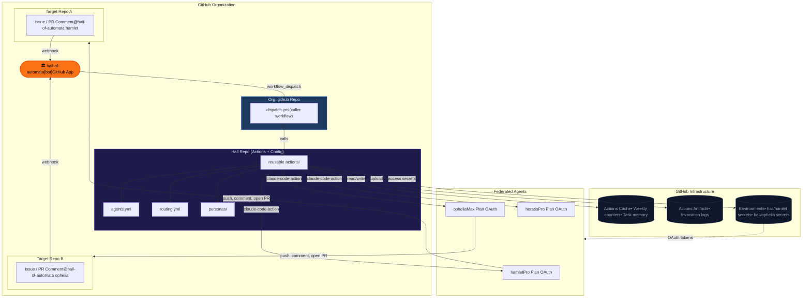
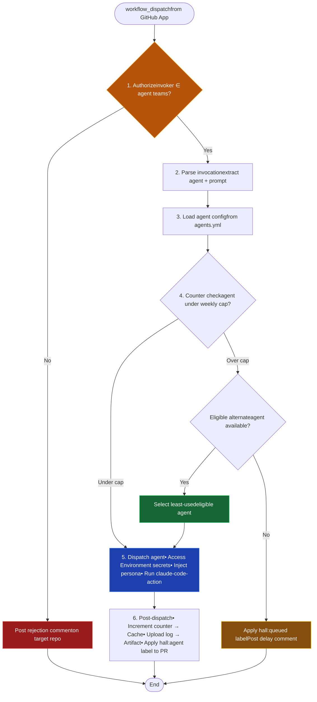
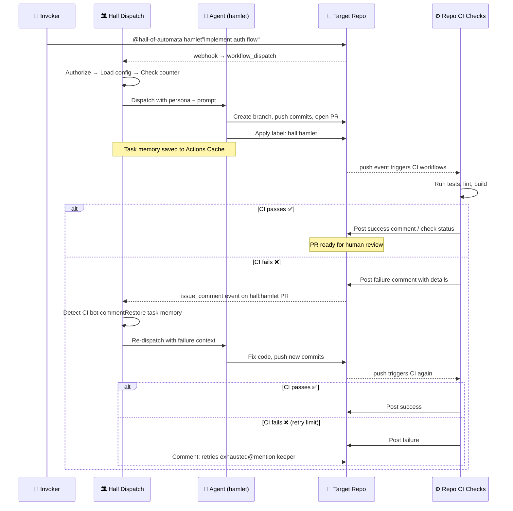
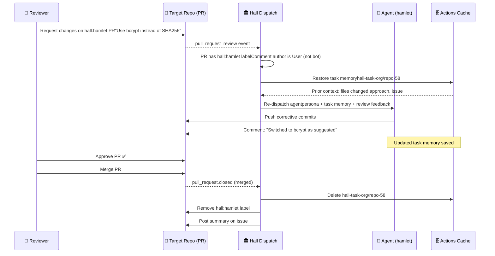
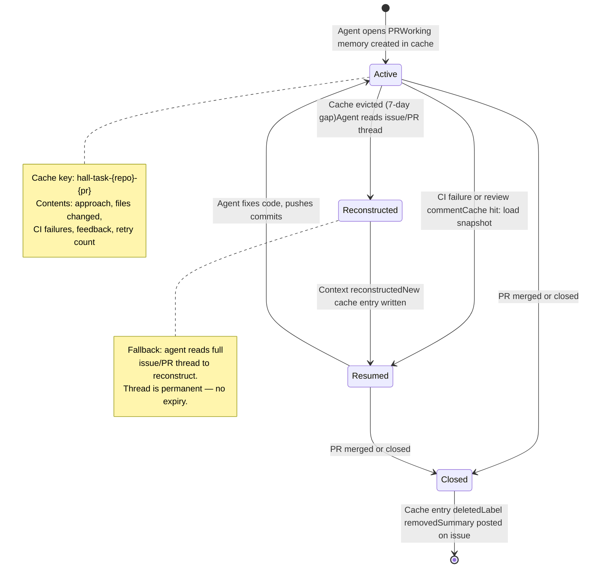

# Hall of Automata — Design Document

**Status:** Draft\
**Authors:** [The lore-keeper](https://github.com/mksetaro), Hamlet 🐗\
**Version:** 0.3\
**Date:** March 2026

## 1. Problem Statement

Modern software teams increasingly rely on AI coding agents for implementation, review, and maintenance tasks. Today, using Claude as an automated agent in GitHub workflows requires each individual to hold a separate API billing account — even if they already pay for a Claude Pro or Max subscription. This creates three problems.

First, cost duplication. Contributors who already pay $20–200/month for Claude subscriptions must pay again for API access to automate the same model in CI/CD. There is no native way to pool subscription quota across a team for shared automation.

Second, fragmented agent identity. When multiple team members run Claude agents through GitHub Actions, each invocation appears as the generic `github-actions[bot]`. There is no unified identity, no shared history, and no way to tell which agent (or whose quota) handled a given task.

Third, uncontrolled consumption. Without centralized tracking, a single automated workflow can silently exhaust a contributor's entire weekly quota — leaving them unable to use Claude interactively for their own work. There is no cap enforcement, no routing intelligence, and no visibility into how shared quota is being consumed.

Hall of Automata solves these problems by introducing a federated agent orchestration layer built as a GitHub App. Contributors donate their Claude subscription quota to a shared pool. The Hall dispatches agents on demand, tracks consumption, enforces caps, and provides a unified bot identity across the organization — all without requiring a single API key.

---

## 2. Core Idea

Hall of Automata is a GitHub App installed at the organization level. It acts as the single portal through which federated Claude agents are dispatched to any repository in the org.

The interaction model is simple: a team member comments `@hall-of-automata <agent>` on an issue or pull request, or applies a GitHub label matching the agent's name to the issue. The issue body or PR comment provides all the context the agent needs. The Hall validates the invoker's authorization, selects the right agent and its federated OAuth token, and dispatches a Claude Code Action against the target repository. The agent works, opens a PR, and the Hall applies a label (e.g., `hall:hamlet`) to bind all subsequent interactions — CI results, reviewer feedback, follow-up comments — to that agent for the PR's lifetime. When the PR is merged, the label is removed and the agent's context is cleaned up.

All agent definitions, personas, routing rules, and reusable dispatch actions live in the Hall repository. The dispatch entry-point workflow lives in the org's `.github` repo and calls the Hall's actions. Target repositories require only the app installation — no local configuration.

### Architecture Overview



The Hall tracks every invocation against a weekly counter per agent. When an agent exceeds its cap, the Hall automatically reroutes the task to the least-used eligible agent. This counter data enables future heuristics for intelligent routing without requiring any changes to the invocation interface.

---

## 3. Use Cases

### UC-1: On-Demand Implementation

A developer creates a GitHub issue describing a feature. They either comment `@hall-of-automata hamlet` on the issue or apply the `hamlet` label directly. The Hall validates the developer's team membership, dispatches the agent with the issue body as context, and the agent implements the feature, opens a PR linked to the issue. The Hall applies a `hall:hamlet` label to the PR so all subsequent interactions route back to the same agent.

### UC-2: Agent Reacts to PR Review

A reviewer requests changes on an agent-authored PR. Because the PR carries the `hall:hamlet` label, the Hall routes the review comment back to the same agent. The agent reads the feedback, makes corrections, and pushes new commits. The reviewer sees the updates and can approve or request further changes.

### UC-3: Agent Orchestrates CI Checks

After pushing code, the agent comments on the PR to trigger the repository's existing CI workflow (e.g., `/run-checks`). When CI completes and posts its results as a PR comment, the Hall detects the comment, identifies it as a CI result (via a known comment pattern or bot identity), and re-dispatches the same agent with the failure context. The agent reads the errors, fixes the code, pushes again, and re-triggers checks. This loop repeats up to a configurable retry limit.

### UC-4: Cap-Based Automatic Routing

A developer requests a specific agent, but that agent has hit its weekly cap of 40 invocations. The Hall checks routing rules, finds an alternate agent with capacity and overlapping capabilities, and dispatches the alternate instead. The invoker is notified of the reroute in the response comment.

### UC-5: Task Cleanup on Merge

When the agent's PR is merged, a workflow fires that cleans up the agent's task-specific cache (working memory for the task), removes the `hall:<agent>` label, and optionally posts a summary comment on the original issue.

### UC-6: Queued Task on Full Capacity

All eligible agents are at their weekly cap. The Hall applies a `hall:queued` label to the issue, posts a comment explaining the delay, and a scheduled workflow re-dispatches the task when counters reset on the configured day.

### End-to-End Lifecycle

```mermaid
flowchart LR
    subgraph INVOKE["Invocation"]
        IS["Issue createdwith context"] --> MN["User comments@hall-of-automata agentor applies agent label"]
    end

    subgraph DISPATCH["Dispatch"]
        MN --> AU{"Authorized?"}
        AU -->|No| RJ["Rejected"]
        AU -->|Yes| CAP{"Under cap?"}
        CAP -->|Over| RT["Reroute / Queue"]
        CAP -->|Yes| AG["Agent dispatched"]
    end

    subgraph WORK["Agent Work"]
        AG --> IMPL["Read issueImplement solution"]
        IMPL --> PR["Open PRLabel: hall:agent"]
    end

    subgraph CILOOP["CI Loop"]
        PR --> CI{"CI passes?"}
        CI -->|Yes| REV
        CI -->|No| FIX["Agent reads failuresFixes code"] --> CI
    end

    subgraph REVIEW["Review Loop"]
        REV{"Reviewapproved?"} -->|Changes requested| ADDR["Agent addressesfeedback"] --> REV
        REV -->|Approved| MRG
    end

    subgraph CLOSE["Cleanup"]
        MRG["PR Merged"] --> CLN["Delete task memoryRemove labelPost summary"]
    end

    style INVOKE fill:#1e1b4b,stroke:#4338ca,color:#e0e7ff
    style DISPATCH fill:#172554,stroke:#2563eb,color:#dbeafe
    style WORK fill:#052e16,stroke:#16a34a,color:#dcfce7
    style CILOOP fill:#422006,stroke:#d97706,color:#fef3c7
    style REVIEW fill:#4a044e,stroke:#c026d3,color:#fae8ff
    style CLOSE fill:#1c1917,stroke:#78716c,color:#e7e5e4
```



---

## 4. Requirements

### 4.1 Functional Requirements

**FR-1: Invocation.** The system must dispatch an agent when (a) a comment containing `@hall-of-automata <agent>` is posted on an issue or PR, or (b) a GitHub label matching a registered agent name is applied to an issue, in any org repository where the app is installed.

**FR-2: Authorization.** The system must validate that the invoker is a member of at least one GitHub team authorized for the requested agent before any workflow logic executes. Unauthorized invocations must be rejected immediately with a clear response.

**FR-3: Agent Resolution.** The system must resolve the agent identifier (from mention or label) to a specific OAuth token and persona file defined in the Hall repository's agent registry.

**FR-4: Dispatch.** The system must invoke the Claude Code Action with the resolved agent's OAuth token and persona, targeting the repository where the mention occurred.

**FR-5: PR Labeling.** When an agent opens a PR, the system must apply a GitHub label (e.g., `hall:hamlet`) that binds all subsequent PR events (review comments, CI results) to the same agent for the lifetime of that PR.

**FR-6: CI Orchestration.** The agent must be able to trigger existing CI checks on the target repository (via comment or commit push) and must be re-dispatched when CI results are posted, with the failure context included in the prompt.

**FR-7: Review Interaction.** When a reviewer posts comments or requests changes on an agent-labeled PR, the bound agent must be re-dispatched with the review context to address feedback.

**FR-8: Weekly Counting.** The system must track the number of invocations per agent per week and enforce configurable caps.

**FR-9: Automatic Routing.** When the requested agent exceeds its weekly cap, the system must reroute to the least-used eligible agent based on capability match.

**FR-10: Task Memory.** The agent must be able to persist task-specific working memory in Actions Cache for the duration of the task, keyed by issue/PR number. The whole dispatch-to-merge flow is fully async and may span days or weeks; if the cache entry expires during an inactive period, the agent must reconstruct its context by re-reading the issue or PR thread, which serves as the permanent, human-readable history of the task.

**FR-11: Cleanup.** On PR merge, the system must delete the agent's task-specific cache, remove the `hall:<agent>` label, and optionally post a summary on the originating issue.

### 4.2 Non-Functional Requirements

**NFR-1: No runtime artifacts in the Hall repo.** All runtime state (counters, task memory, audit logs) must be stored in GitHub infrastructure: Actions Cache for mutable state, Actions Artifacts for immutable logs.

**NFR-2: Org-scoped.** The app must be installable at the organization level and operate across all repositories where it is installed.

**NFR-3: Secret isolation.** Each agent's OAuth token must be stored in a dedicated GitHub Environment in the Hall repo, not as a repo-level secret.

**NFR-4: Naming independence.** Agent naming, identities, and trust are governed by the federation contract, which is outside the scope of this system. The Hall treats agent identifiers as opaque labels resolved through the registry.

**NFR-5: Claude Code compatibility.** The system targets Claude Pro/Max subscriptions authenticated via OAuth tokens (`claude setup-token`), not Claude API keys. All agent invocations must use the Claude Code Action's `claude_code_oauth_token` input.

**NFR-6: Audit trail.** Every invocation must produce an immutable artifact containing the agent identifier, invoker, target repo, timestamp, outcome, and resource consumption.

---

## 5. System Design

### 5.1 GitHub App

The app is the Hall's identity on GitHub. It is registered as a GitHub App at the organization level with the following configuration.

**Identity:** The app has a custom name ("Hall of Automata") and avatar. All comments and status updates posted through the app's installation token appear as `hall-of-automata[bot]`.

**Webhook events subscribed:** `issue_comment`, `pull_request_review_comment`, `pull_request_review`, `issues` (for label application and assignment), `check_suite`, `pull_request` (for merge detection and label changes).

**Permissions:** Contents (read/write), Issues (read/write), Pull Requests (read/write), Members (read), Metadata (read), Statuses (read/write). Checks permission is discussed in Appendix B.

**Webhook relay:** The app receives events and triggers `workflow_dispatch` on the org's `.github` repo dispatch workflow, forwarding the event payload as inputs. The caller workflow in the `.github` repo invokes reusable actions defined in the Hall repo. This separates the dispatch entry point (org-owned) from the implementation (Hall-owned), keeping org-specific configuration local while the Hall repo remains a stable, shared action library.

### 5.2 Dispatch Workflow

The dispatch workflow is the central orchestrator. It runs in two layers: a thin caller workflow in the org's `.github` repo receives the `workflow_dispatch` trigger from the App and invokes reusable composite actions defined in the Hall repo. All orchestration logic lives in the Hall repo's reusable actions; the `.github` caller only wires inputs and secrets through.



**Step 1 — Authorization (gate).** Before any other logic, the workflow validates the invoker's GitHub team membership against the agent's authorized teams list. If unauthorized, the workflow posts a rejection comment on the target repo and exits. No counter is incremented. No cache is read. This is the first step, not an intermediate one.

**Step 2 — Parse invocation.** Extract the agent identifier and prompt from the comment body (if triggered by mention) or from the label name (if triggered by label application). The prompt is everything after the agent name in a mention, or the issue body for label-triggered dispatch. The issue or PR body provides additional context.

**Step 3 — Load agent config.** Read `agents.yml` from the Hall repo. Resolve the agent identifier to: OAuth token secret name, persona file path, authorized teams, capability list, max turns, and retry limit.

**Step 4 — Counter check.** Restore the weekly counter from Actions Cache. If the requested agent is under its cap, proceed. If over cap, apply the routing strategy from `routing.yml` to select an alternate agent. If all eligible agents are capped, queue the task (apply `hall:queued` label, post comment, exit).

**Step 5 — Dispatch agent.** The job references the agent's GitHub Environment (e.g., `hall/hamlet`) to access the isolated OAuth token. It checks out the target repository, injects the agent's persona, and runs `anthropics/claude-code-action@v1` with the OAuth token and prompt.

**Step 6 — Post-dispatch.** Increment the counter and save to Actions Cache. Upload the invocation log as an Actions Artifact. If the agent opened a PR, apply the `hall:<agent>` label to bind future events.

### 5.3 CI Orchestration Loop

The agent does not own CI. The target repository has its own check workflows — linters, tests, builds — that run on push or on PR events. The agent's role is to trigger these checks and react to their outcomes.



**Triggering checks.** When the agent pushes commits or opens a PR, the target repo's existing CI workflows fire automatically (on `push` or `pull_request` events). If the repo uses comment-triggered checks (e.g., `/run-checks`), the agent posts that comment.

**Reacting to results.** CI workflows post their results — either as PR comments (from a CI bot), as check suite conclusions, or as commit statuses. The Hall's dispatch workflow listens for these signals on agent-labeled PRs.

When a CI result arrives on a PR labeled `hall:<agent>`:

1. The dispatch workflow identifies the bound agent from the label.
2. It restores the agent's task memory from Actions Cache (keyed by PR number).
3. It re-dispatches the same agent with the CI failure output appended to the prompt.
4. The agent reads the errors, fixes the code, and pushes new commits.
5. CI fires again on the new push.

This loop repeats up to `max_retries` (configured per agent in `agents.yml`). If retries are exhausted, the Hall posts a PR comment `@mentioning` the keeper (configured per agent in `agents.yml`) with the last failure context, and updates the issue status card to `Escalated`.

**Distinguishing CI comments from human comments.** The dispatch workflow must only re-dispatch on CI results, not on every PR comment. This is done by filtering on the comment author's identity (e.g., `github-actions[bot]`, a known CI app login) or by matching a hidden HTML marker pattern (e.g., `<!-- ci-result -->`) that the CI workflow includes in its output.

### 5.4 Review Interaction Loop

When a human reviewer posts a comment or submits a review on an agent-labeled PR:



1. The dispatch workflow detects the event on a `hall:<agent>` labeled PR.
2. It filters out bot comments (only reacts to `user.type == 'User'` or known reviewer bots).
3. It restores the agent's task memory from cache.
4. It re-dispatches the bound agent with the review feedback as context.
5. The agent addresses the feedback, pushes commits, and the reviewer is notified.

The agent maintains continuity across these interactions through task memory, described in Section 5.5.

### 5.5 Task Memory and Cleanup

Task memory operates in two layers with distinct roles and lifecycles.

**Layer 1 — Actions Cache (working memory).** A per-task cache entry keyed by `hall-task-{repo}-{pr_number}` stores the agent's structured working state: current approach, files modified, CI failure history, and review feedback. This is a compact, machine-readable snapshot optimized for fast load on re-dispatch. It is written at the end of each dispatch cycle and restored at the start of the next.

GitHub evicts cache entries that have not been accessed for 7 days. This is acceptable: the working memory is a performance layer, not the source of truth. If the entry is evicted during a long async pause (e.g., the invoker takes a week to reply to an agent question), the agent reconstructs context from Layer 2.

**Layer 2 — Issue/PR thread (natural memory).** The complete history of every invocation, status update, clarification exchange, agent response, CI result, and review comment is recorded in the triggering issue or PR thread. This thread never expires. It is human-readable, accessible to anyone with repo access, and serves as the permanent audit trail and fallback context source.

On cache miss, the dispatch workflow passes the thread URL to the agent as part of the prompt. The agent reads the thread, reconstructs its working state, and continues. A new cache entry is written at the end of that dispatch cycle.

This design makes the full dispatch-to-merge flow resilient to async gaps of any duration. A task can be paused indefinitely while waiting for user input and will resume correctly regardless of cache state.



**Cleanup** is triggered by a `pull_request` event with action `closed` (merged or not). When a PR with a `hall:<agent>` label is closed:

1. The task memory cache entry is deleted.
2. The `hall:<agent>` label is removed from the PR.
3. If the PR was linked to an issue, an optional summary comment is posted on the issue.

The issue/PR thread is never modified on cleanup — it remains as the permanent history of the task.

### 5.6 Runtime State Storage

| State | Storage | Key Pattern | Lifecycle |
|-------|---------|-------------|-----------|
| Weekly counters | Actions Cache | `hall-counters-{YYYY}-W{WW}` | Resets weekly (key expires naturally) |
| Task memory | Actions Cache | `hall-task-{repo}-{pr_number}` | Created on first dispatch, deleted on PR close |
| Invocation logs | Actions Artifacts | `hall-log-{agent}-{issue}-{timestamp}` | Immutable, retained per GitHub policy (90 days) |
| Agent secrets | GitHub Environments | `hall/{agent}` | Managed by Hall maintainers |

---

## 6. UX/UI Considerations

Hall of Automata has no custom frontend. GitHub is the interface. The design principle is: every meaningful state transition must be visible on a GitHub surface that the relevant person would naturally navigate to, without requiring knowledge of the Hall's internals.

### 6.1 Entry Points and Phase Assignment

The Hall has two invocation entry points that determine which phase a task starts in.

**Issue entry point → begins at Phase 1.** A comment or label on an issue where no PR yet exists. The Hall works through Phase 1 (dispatch → analysis → optional clarification → working → PR open) before transitioning to Phase 2.

**PR entry point → begins at Phase 2.** A comment on an existing PR (e.g., invoking the Hall directly on a PR not originally authored by the Hall). There is no Phase 1. The Hall posts its status card directly on the PR and begins the CI/review loop immediately.

In both cases the GitHub Issues API is used identically — GitHub's data model treats PRs as issues, and `POST /repos/{owner}/{repo}/issues/{number}/comments` works for both. The Hall makes no distinction at the API layer.

### 6.2 Phase 1 — Issue as Dashboard

When invoked from an issue, the Hall immediately posts a **status card comment** on the issue. This is a single comment from `hall-of-automata[bot]`, edited in-place at each sub-stage transition. No new comments are posted for status updates. A hidden HTML marker (`<!-- hall-status -->`) allows the dispatch workflow to locate and overwrite it deterministically.

Phase 1 has four explicit sub-stages:

1. **Dispatching** — Hall validates the invoker, selects and configures the agent.
2. **Analyzing** — Agent reads the issue and codebase, assesses scope and feasibility.
3. **Awaiting input** _(conditional)_ — Agent determines it needs clarification and posts a question on the issue. The status card is updated. This state is indefinite: the Hall waits for a non-bot `issue_comment` event on the issue, then re-dispatches the agent with the full thread as context — including the user's reply. There is no timeout.
4. **Working (WIP)** — Agent has sufficient context and begins implementation on a branch.

All comments in the issue thread — agent questions, user replies, status card updates — are posted by `hall-of-automata[bot]` via the App installation token. Agent persona is expressed through comment content and `hall:{agent}` labels, not through separate GitHub accounts.

### 6.3 Phase 2 — PR as Dashboard

When the agent opens a PR (from Phase 1) or when the Hall is invoked directly on a PR (Phase 2 entry), the PR page becomes the primary working surface. The issue status card continues to be updated in-place on the issue thread throughout Phase 2 — it is the invoker's single-pane view of the task from start to finish. For PR-entry invocations (no issue exists), the status card is posted on the PR itself.

The Hall reads the repo's CI check runs to drive the fix loop; it does not create its own check runs. PR comments carry the agent-reviewer conversation.

### 6.4 The Status Card

```markdown
<!-- hall-status -->
### Hall — hamlet

| | |
|---|---|
| **Stage** | Analyzing... |
| **Dispatched** | 2026-03-06 14:22 UTC |
| **Branch** | — |
| **PR** | — |
```

Stage values across the full lifecycle:

| Sub-stage | Stage value |
|-----------|------------|
| Dispatching | Dispatching agent... |
| Analyzing | Analyzing... |
| Awaiting user input | Awaiting context — question posted |
| Working | Working — `hall/hamlet/issue-42` |
| PR opened | PR opened — #58 |
| CI fix loop active | CI fix in progress (attempt 2 / 3) |
| Retries exhausted | Escalated — @{keeper} notified |
| PR merged | Done — PR #58 merged |

### 6.5 Escalation to Keeper

When `max_retries` is exhausted:

1. The status card is edited to `Escalated — @{keeper} notified`.
2. A PR comment `@mentions` the keeper with the last CI failure summary.

The keeper receives a GitHub notification, lands on the PR, and has the full thread history and the repo's CI check run results in the Checks tab. The keeper's GitHub handle is configured per agent in `agents.yml` (see Appendix C).

### 6.6 UI Summary

| Phase | Primary surface | Signal |
|-------|----------------|--------|
| Pre-PR (issue entry) | Issue thread | Status card, edited in-place |
| Awaiting input | Issue thread | Status card + agent question comment |
| PR open (either entry) | PR thread | Status card + CI check runs |
| PR conversation | PR comments | Agent reports, reviewer feedback |
| Escalation | PR comment | Keeper @mention |
| Done | Status card | Final stage value |

---

## 9. Appendix C: Agent Configuration Reference

### agents.yml

```yaml
agents:
  hamlet:
    secret: CLAUDE_CODE_OAUTH_TOKEN     # secret name within the agent's environment
    persona: personas/hamlet.md
    teams: [core-devs]
    max_turns: 40
    max_retries: 3
    capabilities: [implement, review, fix, refactor]
    keeper: mksetaro                    # GitHub handle to @mention on retry exhaustion

  ophelia:
    secret: CLAUDE_CODE_OAUTH_TOKEN
    persona: personas/ophelia.md
    teams: [core-devs, reviewers]
    max_turns: 20
    max_retries: 2
    capabilities: [review, comment]
    keeper: mksetaro
```

### routing.yml

```yaml
routing:
  weekly_cap: 25                        # default per-agent
  reset_day: monday

  overrides:
    hamlet:
      weekly_cap: 40
    ophelia:
      weekly_cap: 15

  fallback: queue                       # queue | reject

  strategy: least_used
```

### Persona File (roster/hamlet.md)

Example:

```markdown
You are Hamlet, a full-stack implementation agent in the Hall of Automata.

Your responsibilities:
- Read the issue or task description carefully.
- Plan your approach before writing code.
- Implement the requested changes following the repo's existing patterns.
- Write or update tests for your changes.
- Open a PR linked to the originating issue.

When reacting to CI failures:
- Read the failure output carefully.
- Fix the root cause, do not suppress tests.
- Push corrective commits to the same branch.

When reacting to reviewer feedback:
- Address each comment individually.
- If you disagree with a suggestion, explain your reasoning.
- Push corrective commits and summarize what you changed.
```

---

## 10. Appendix D: Invocation Counter Schema

Stored in Actions Cache under key `hall-counters-{YYYY}-W{WW}`.

```json
{
  "week": "2026-W10",
  "counts": {
    "hamlet": 18,
    "ophelia": 7
  }
}
```

The `invocations` detail is captured per-dispatch in Actions Artifacts, not in the counter. The counter is kept minimal to reduce cache read/write overhead and avoid hitting cache size limits under heavy usage.

---

## 11. Appendix E: Invocation Audit Log Schema

Uploaded as an Actions Artifact per dispatch.

```json
{
  "agent_requested": "hamlet",
  "agent_dispatched": "hamlet",
  "rerouted": false,
  "repo": "org/target-repo",
  "issue": 42,
  "pr": 58,
  "invoker": "username",
  "team_validated": "core-devs",
  "timestamp_start": "2026-03-06T14:22:00Z",
  "timestamp_end": "2026-03-06T14:34:12Z",
  "turns_used": 12,
  "turns_max": 40,
  "retry_count": 0,
  "files_changed": ["src/auth/login.ts", "src/routes/api.ts"],
  "outcome": "pr_created",
  "weekly_count_after": 19
}
```